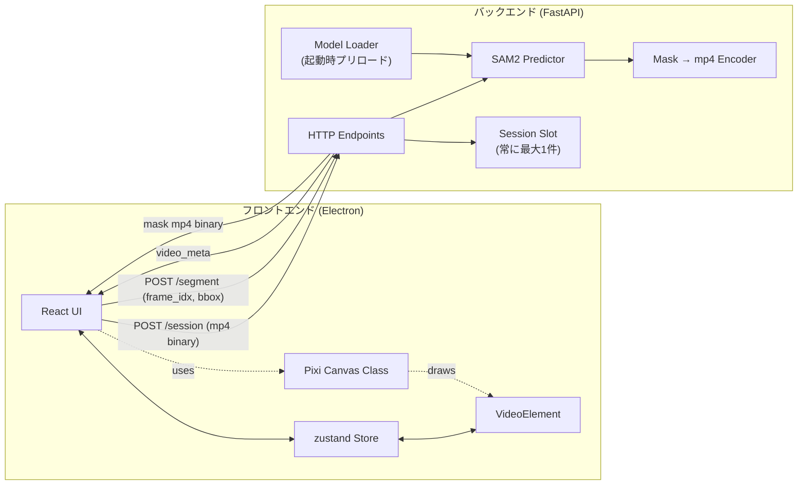
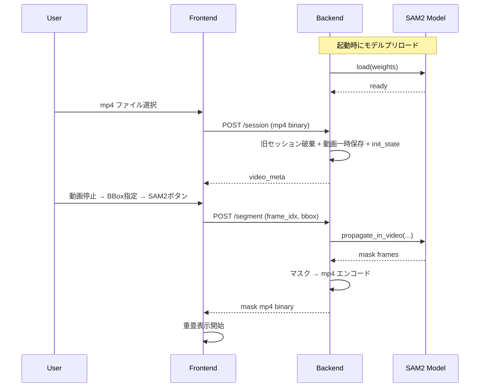

# 02. 全体アーキテクチャ

## 2.1 システム構成



主な特徴:
- フロントエンドは Electron アプリ。React がUI、Pixi がキャンバス描画、zustand が状態を担当
- バックエンドは FastAPI。起動時に SAM2 モデルをプリロード
- 通信はすべて HTTP。mp4 はリクエスト/レスポンスともにバイナリで送受
- バックエンドは常に最大 1 件の動画セッションだけを保持する（新規 `/session` で旧セッションは自動破棄）。クライアント・サーバー間でセッション ID をやり取りしない

## 2.2 ディレクトリ構成

リポジトリ全体の構成は以下のとおり。

```
omnimatte-editor/
├── README.md
├── docs/
│   └── spec/                       # 本仕様書
├── server/                         # 本プロジェクトのFastAPIサーバ
│   ├── __init__.py                 # 空
│   ├── main.py                     # FastAPIエントリポイント
│   ├── model.py                    # SAM2モデルのロード状態管理 + 設定値（ハードコード）
│   ├── session.py                  # セッションスロット（常に最大1件）
│   ├── video_io.py                 # mp4 読み書き、マスク → mp4 エンコード
│   ├── routes/
│   │   ├── __init__.py
│   │   ├── health.py
│   │   ├── session.py
│   │   └── segment.py
│   └── schemas.py                  # Pydanticスキーマ
├── vendor/
│   └── sam2/                       # SAM2 公式リポジトリ（依存ライブラリとして配置）
│       └── examples/
│           └── segment_video_server.py
├── run.py                          # 起動スクリプト（uvicorn 起動のみ）
├── requirements.txt                # SAM2 (-e ./vendor/sam2) を含む
└── frontend/
    ├── package.json
    ├── electron.vite.config.ts
    ├── tsconfig.json
    ├── index.html
    ├── src/
    │   ├── main/                   # Electron main プロセス
    │   │   └── index.ts
    │   ├── preload/                # preload スクリプト
    │   │   └── index.ts
    │   └── renderer/               # React アプリ本体
    │       ├── main.tsx            # React エントリ
    │       ├── App.tsx
    │       ├── api/                # バックエンド呼び出し
    │       │   └── client.ts
    │       ├── components/
    │       │   ├── TopBar/
    │       │   │   ├── TopBar.tsx
    │       │   │   ├── LoadVideoButton.tsx
    │       │   │   └── Sam2Button.tsx
    │       │   ├── Canvas/
    │       │   │   ├── CanvasView.tsx           # React ラッパ
    │       │   │   └── VideoCanvas.ts           # Pixi クラス（07-pixi-canvas.md）
    │       │   └── BottomBar/
    │       │       ├── BottomBar.tsx
    │       │       ├── PlaybackControls.tsx     # 再生/停止/コマ送り/コマ戻し
    │       │       ├── Seekbar.tsx              # シークバー
    │       │       └── TimeDisplay.tsx          # 時間 + フレーム番号表示
    │       ├── store/
    │       │   └── videoStore.ts                # VideoElementとzustandの同期（08-state-management.md）
    │       └── types/
    │           └── index.ts
    └── README.md                   # フロントエンドの起動手順
```

`vendor/sam2/` は SAM2 公式リポジトリそのもの（依存ライブラリとして配置）。本プロジェクトのサーバ実装は `server/` に配置し、`vendor/sam2/examples/segment_video_server.py` をコピペするのではなく、参考にしながら本仕様に合わせて再実装する。

`vendor/` 層を挟むのは、`sam2/` リポジトリが内部に同名 `sam2/sam2/` パッケージを持つため、`server/` などと同じ階層に置くと `import sam2` 時に namespace package として shadowing されるのを防ぐため。`vendor/sam2/` は sys.path 上のどのエントリ直下にも来ないので、editable install の finder 経由で正規パッケージが解決される。

## 2.3 ビルド／起動の概要

### バックエンド

```bash
# 環境構築（初回のみ。project root で実行）
pip install -r requirements.txt   # SAM2 (-e ./vendor/sam2) と依存ライブラリを一括インストール

# 起動（推奨・OS 非依存）
python run.py
```

`requirements.txt` の冒頭で `-e ./vendor/sam2` を指定しているため、SAM2 本体は editable インストールされる。`run.py` は単に uvicorn を起動するだけのラッパスクリプト（sys.path 操作は不要）。

uvicorn を直接使う場合は project root から `uvicorn server.main:app` でも可。

### フロントエンド

```bash
# 環境構築（初回のみ）
cd frontend
npm install

# 開発起動
npm run dev
```

`VITE_API_BASE` 環境変数でバックエンドURLを切り替える。

## 2.4 通信プロトコル概要



詳細なリクエスト/レスポンスは [04-api.md](04-api.md) 参照。

## 2.5 主要モジュール責務サマリ

| モジュール | 責務 | 詳細仕様 |
|---|---|---|
| `server/main.py` | FastAPI 起動、ルータ登録、CORS、lifespan で非同期ロード起動 | [03-backend.md](03-backend.md) |
| `server/model.py` | SAM2 モデルのロード状態管理 + 設定値ハードコード | [03-backend.md](03-backend.md) |
| `server/session.py` | 現在の inference_state を保持する単一スロット | [03-backend.md](03-backend.md) |
| `server/video_io.py` | mp4 デコード、マスク → mp4 エンコード | [03-backend.md](03-backend.md) |
| `frontend/src/renderer/store/videoStore.ts` | zustandストア + VideoElement同期 | [08-state-management.md](08-state-management.md) |
| `frontend/src/renderer/components/Canvas/VideoCanvas.ts` | Pixi 描画ロジック | [07-pixi-canvas.md](07-pixi-canvas.md) |
| `frontend/src/renderer/components/Canvas/CanvasView.tsx` | Pixi クラスを React コンポーネントとしてラップ | [07-pixi-canvas.md](07-pixi-canvas.md) |
| `frontend/src/renderer/components/TopBar/Sam2Button.tsx` | SAM2 実行ボタン。BBoxの有無で活性制御 | [09-state-transitions.md](09-state-transitions.md) |

## 2.6 実装チェックリスト

- [ ] `server/` と `frontend/src/renderer/` のディレクトリが本仕様どおりに配置されている
- [ ] バックエンドは project root から `python run.py` または `uvicorn server.main:app` で起動できる
- [ ] フロントエンドは `npm run dev` で Electron ウィンドウが開く
- [ ] `VITE_API_BASE` でローカル/クラウドが切り替えられる
- [ ] フロントエンドからバックエンドの `/health` を呼んで疎通確認できる
