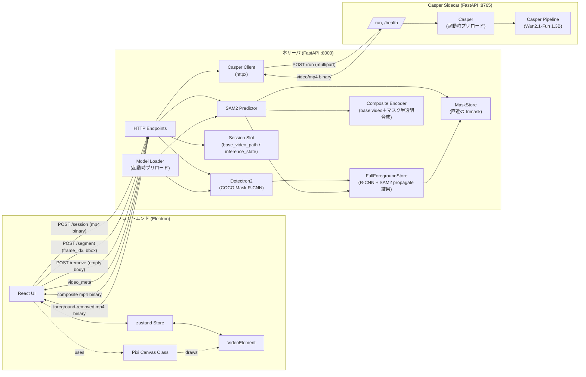
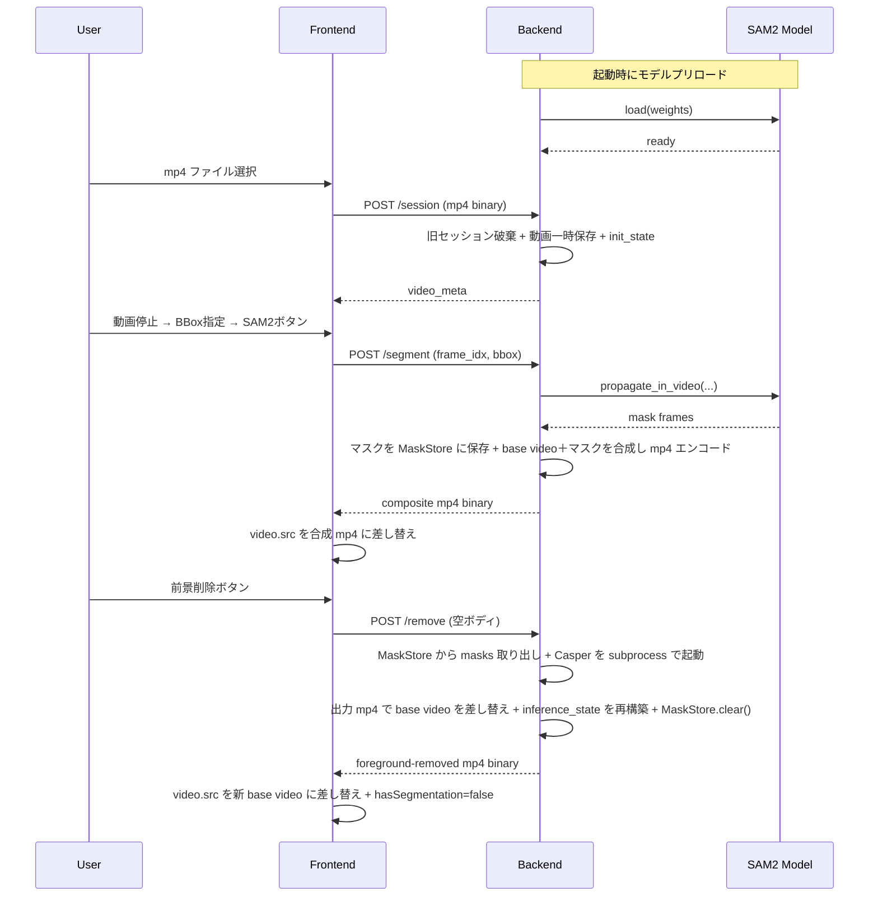

# 02. 全体アーキテクチャ

## 2.1 システム構成



主な特徴:
- フロントエンドは Electron アプリ。React がUI、Pixi がキャンバス描画、zustand が状態を担当
- バックエンドは **本サーバ（SAM2 担当, FastAPI :8000）** と **Casper Sidecar（前景削除担当, FastAPI :8765）** の 2 プロセス。両方とも起動時にモデルをプリロード
- フロントから sidecar は見えない。常に本サーバ 1 本を相手にする
- 通信はすべて HTTP。mp4 はリクエスト/レスポンスともにバイナリで送受
- `/segment` のレスポンスはマスク単体ではなく、**サーバ側で base video にマスクを半透明合成済みの mp4**。フロントは `<video>` 1 本で再生するだけになり、原動画とマスク動画の同期問題が発生しない
- `/remove` は SAM2 マスクで指定した前景を base video から削除した mp4 を返し、**サーバ側のセッションのベース動画も新動画に差し替える**（カスケード）。Casper の重い処理は本サーバ → sidecar への HTTP 経由で実行される
- バックエンドは常に最大 1 件の動画セッションだけを保持する（新規 `/session` で旧セッションは自動破棄）。クライアント・サーバー間でセッション ID をやり取りしない
- 直近の SAM2 マスクは `MaskStore` がサーバ側で保持し、`/remove` の入力に使う（フロント⇔サーバ間でマスクを往復させない）

## 2.2 ディレクトリ構成

リポジトリ全体の構成は以下のとおり。

```
omnimatte-editor/
├── README.md
├── docs/
│   └── spec/                       # 本仕様書
├── backend/                         # 本サーバ（SAM2 担当）。閉じた subproject
│   ├── __init__.py                 # 空
│   ├── main.py                     # FastAPI エントリ。lifespan で SAM2 ロード起動 + sidecar spawn
│   ├── model.py                    # SAM2 モデルのロード状態管理 + SAM2 / Casper 設定値（ハードコード）
│   ├── session.py                  # セッションスロット（常に最大1件）。base video の差し替えも担当
│   ├── mask_store.py               # 直近 SAM2 結果（per-frame バイナリマスク）の単一スロット
│   ├── casper_client.py            # sidecar への HTTP クライアント（httpx）
│   ├── video_io.py                 # mp4 読み書き、マスク → mp4 エンコード
│   ├── routes/
│   │   ├── __init__.py
│   │   ├── health.py
│   │   ├── session.py
│   │   ├── segment.py
│   │   └── removal.py              # POST /remove
│   ├── schemas.py                  # Pydanticスキーマ
│   ├── run.py                      # 本サーバ起動スクリプト（uvicorn）。lifespan で sidecar も自動 spawn
│   ├── requirements.txt            # backend の Python 依存。SAM2/Detectron2 は git+ URL から別途インストール
│   ├── vendor/
│   │   └── gen-omnimatte-public/   # Casper（Wan2.1-1.3B）リポジトリ（git submodule）
│   └── models/
│       └── sam2/
│           └── sam2.1_hiera_large.pt   # SAM2 チェックポイント（README の手順でダウンロード）
├── casper_server/                  # Casper sidecar（前景削除担当）
│   ├── __init__.py                 # 空
│   ├── main.py                     # FastAPI エントリ。lifespan で Casper ロード起動
│   ├── holder.py                   # Casper（loading/ready/failed の状態保持）
│   ├── pipeline.py                 # gen-omnimatte-public のラッパ（load_pipeline / run_one_seq）
│   └── routes/
│       ├── __init__.py
│       ├── health.py               # GET /health
│       └── run.py                  # POST /run （multipart）
└── frontend/
    ├── package.json
    ├── electron.vite.config.ts
    ├── tsconfig.json
    ├── index.html
    ├── src/
    │   ├── main/                   # Electron main プロセス
    │   │   └── index.ts
    │   ├── preload/                # preload スクリプト
    │   │   └── index.ts
    │   └── renderer/               # React アプリ本体
    │       ├── main.tsx            # React エントリ
    │       ├── App.tsx
    │       ├── api/                # バックエンド呼び出し
    │       │   └── client.ts
    │       ├── components/
    │       │   ├── TopBar/
    │       │   │   ├── TopBar.tsx
    │       │   │   ├── LoadVideoButton.tsx
    │       │   │   └── Sam2Button.tsx
    │       │   ├── Canvas/
    │       │   │   ├── CanvasView.tsx           # React ラッパ
    │       │   │   └── VideoCanvas.ts           # Pixi クラス（07-pixi-canvas.md）
    │       │   └── BottomBar/
    │       │       ├── BottomBar.tsx
    │       │       ├── PlaybackControls.tsx     # 再生/停止/コマ送り/コマ戻し
    │       │       ├── Seekbar.tsx              # シークバー
    │       │       └── TimeDisplay.tsx          # 時間 + フレーム番号表示
    │       ├── store/
    │       │   └── videoStore.ts                # VideoElementとzustandの同期（08-state-management.md）
    │       └── types/
    │           └── index.ts
    └── README.md                   # フロントエンドの起動手順
```

`backend/vendor/gen-omnimatte-public/` は Casper モデル用にフォークしているリポジトリで、修正コードを抱えるため submodule で管理する。SAM2 と Detectron2 は upstream を修正していないので、git+ URL から直接 pip インストールする（README 参照）。

## 2.3 ビルド／起動の概要

### バックエンド

```bash
# 環境構築（初回のみ。project root で実行）
pip install -r backend/scripts/requirements.txt
pip install --no-build-isolation 'git+https://github.com/facebookresearch/sam2.git@2b90b9f'
pip install --no-build-isolation 'git+https://github.com/facebookresearch/detectron2.git'

# 起動（推奨・OS 非依存。frontend と対称に subproject 内で実行する）
cd backend
python run.py
```

`backend/run.py` は本サーバを uvicorn 起動するスクリプトで、本サーバの lifespan が **Casper sidecar (`casper_server`) を自動 spawn する**。ユーザーは追加コマンド不要。

uvicorn を直接使う場合は project root から `uvicorn backend.main:app` でも可（同じく lifespan が sidecar を spawn する）。

**sidecar を別マシンに分離する場合**: GPU マシン側で `python run_casper.py` を起動し、本サーバ側は `OMNIMATTE_SPAWN_CASPER=0` と `CASPER_SIDECAR_BASE=<sidecar URL>` を環境変数に設定する。

### フロントエンド

```bash
# 環境構築（初回のみ）
cd frontend
npm install

# 開発起動
npm run dev
```

`VITE_API_BASE` 環境変数でバックエンドURLを切り替える。

## 2.4 通信プロトコル概要



詳細なリクエスト/レスポンスは [04-api.md](04-api.md) 参照。

## 2.5 主要モジュール責務サマリ

| モジュール | 責務 | 詳細仕様 |
|---|---|---|
| `backend/main.py` | FastAPI 起動、ルータ登録、CORS、lifespan で SAM2 ロード起動 + sidecar spawn | [03-backend.md](03-backend.md) |
| `backend/model.py` | SAM2 モデルのロード状態管理 + SAM2 / Casper 設定値ハードコード | [03-backend.md](03-backend.md) |
| `backend/session.py` | 現在の `inference_state` と base video を保持する単一スロット。`swap_base_video` でベース動画差し替え | [03-backend.md](03-backend.md) |
| `backend/mask_store.py` | 直近 SAM2 マスクの単一スロット | [03-backend.md](03-backend.md) |
| `backend/casper_client.py` | sidecar への HTTP クライアント（`httpx`）。マスクを mp4 化して `POST /run` に送る | [03-backend.md](03-backend.md) |
| `backend/video_io.py` | mp4 デコード、base video＋マスクの半透明合成 mp4 エンコード、マスク → mp4 書き出し | [03-backend.md](03-backend.md) |
| `casper_server/main.py` | Casper sidecar の FastAPI エントリ。lifespan で Casper プリロード | [03-backend.md](03-backend.md) |
| `casper_server/holder.py` | Casper パイプラインのロード状態管理（SAM2 の `Sam2` クラスと同パターン） | [03-backend.md](03-backend.md) |
| `casper_server/pipeline.py` | fork 済 `gen-omnimatte-public` の `predict_v2v.load_pipeline` を `importlib` で直接ロードして呼ぶ薄いラッパ。`run_one_seq` は本プロジェクト固有の出力フォーマット・前景のみ書き換え処理を含むため独自実装 | [03-backend.md](03-backend.md) |
| `frontend/src/renderer/store/videoStore.ts` | zustandストア + VideoElement同期 | [08-state-management.md](08-state-management.md) |
| `frontend/src/renderer/components/Canvas/VideoCanvas.ts` | Pixi 描画ロジック | [07-pixi-canvas.md](07-pixi-canvas.md) |
| `frontend/src/renderer/components/Canvas/CanvasView.tsx` | Pixi クラスを React コンポーネントとしてラップ | [07-pixi-canvas.md](07-pixi-canvas.md) |
| `frontend/src/renderer/components/TopBar/Sam2Button.tsx` | SAM2 実行ボタン。BBoxの有無で活性制御 | [09-state-transitions.md](09-state-transitions.md) |
| `frontend/src/renderer/components/TopBar/RemoveForegroundButton.tsx` | 前景削除ボタン。`hasSegmentation` で活性制御 | [09-state-transitions.md](09-state-transitions.md) |

## 2.6 実装チェックリスト

- [ ] `backend/` と `frontend/src/renderer/` のディレクトリが本仕様どおりに配置されている
- [ ] バックエンドは `cd backend && python run.py` または project root から `uvicorn backend.main:app` で起動できる
- [ ] フロントエンドは `npm run dev` で Electron ウィンドウが開く
- [ ] `VITE_API_BASE` でローカル/クラウドが切り替えられる
- [ ] `OMNIMATTE_PORT` 環境変数でバックエンドのリッスンポートが切り替えられる
