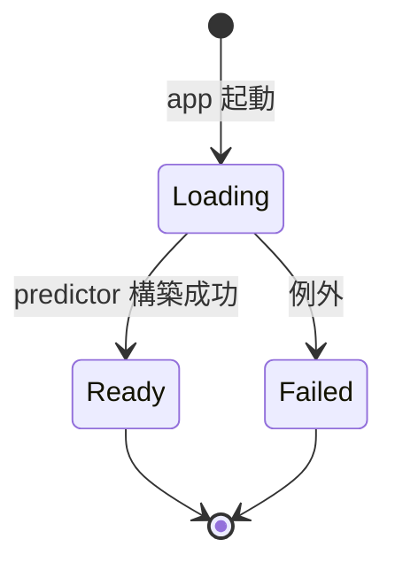
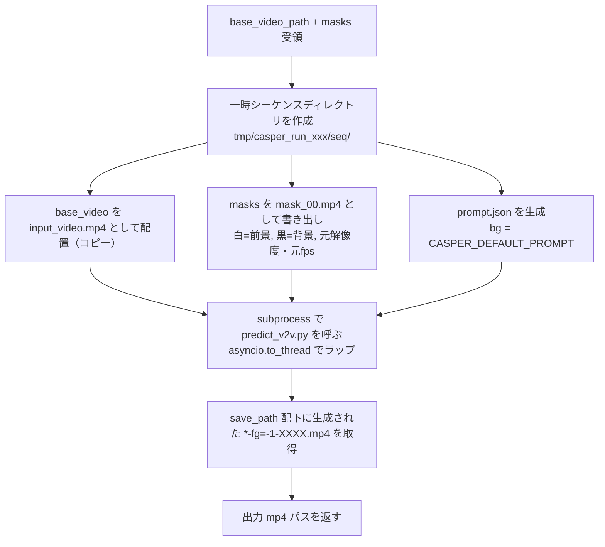

# 03. バックエンド仕様

## 3.1 概要

FastAPI で構築する HTTP サーバ。起動時に SAM2 モデルをバックグラウンドでロードし、フロントエンドからの mp4 アップロードと BBox 付き推論リクエストを受け付ける。レスポンスは **base video にマスクを半透明＋着色合成した mp4 バイナリ**（マスク単体ではなく合成済み）。

加えて、SAM2 で得たマスクを使って base video から前景物体を削除する `/remove` エンドポイントを提供する。前景削除は `vendor/gen-omnimatte-public` の Casper（Wan2.1-1.3B）を subprocess で起動して実行する。

参照実装: [`vendor/sam2/examples/segment_video_server.py`](../../vendor/sam2/examples/segment_video_server.py)

参照実装からの主な差分:
- 出力形式: RLE → **マスクをサーバ側で原動画に半透明合成した mp4 バイナリ**
- モデルロード: 即時グローバル変数化 → **起動時に非同期バックグラウンドロード + ロード状態の問い合わせ**
- ルーティング: 単一ファイル → **`routes/` 配下に分割**
- バリデーション: なし → **Pydantic スキーマで bbox や frame_idx を検証**

## 3.2 ディレクトリ／ファイル構成

[02-architecture.md](02-architecture.md#22-ディレクトリ構成) の `server/` を参照。

```
server/
├── __init__.py        # 空
├── main.py            # FastAPI 起動、ルータ登録、CORS、lifespan
├── model.py           # SAM2 のロード状態管理 + SAM2/Casper 設定値
├── session.py         # セッションスロット（base_video_path / inference_state）+ swap_base_video
├── mask_store.py      # 直近 SAM2 マスクの単一スロット
├── removal.py         # Casper（gen-omnimatte-public）の subprocess 呼び出し
├── video_io.py        # mp4 デコード、合成 mp4 エンコード、マスク → mp4 エンコード
├── routes/
│   ├── __init__.py
│   ├── health.py
│   ├── session.py
│   ├── segment.py
│   └── removal.py
└── schemas.py         # Pydantic スキーマ
```

## 3.3 設定

モデル関連の設定は [`model.py`](../../server/model.py) の冒頭にモジュールレベル定数としてハードコードされている。

| 定数 | 値 | 用途 |
|---|---|---|
| `SAM2_CFG` | `configs/sam2.1/sam2.1_hiera_l.yaml` | SAM2 設定ファイル（hydra で解決） |
| `SAM2_CKPT` | `<project_root>/vendor/sam2/checkpoints/sam2.1_hiera_large.pt` | チェックポイントの絶対パス（`__file__` 起点で解決） |
| `SAM2_DEVICE` | `cuda` | 推論デバイス |

Casper（前景削除）関連は同様に `model.py` または `removal.py` の冒頭にハードコードする。

| 定数 | 値 | 用途 |
|---|---|---|
| `CASPER_REPO_DIR` | `<project_root>/vendor/gen-omnimatte-public` | Casper リポジトリのルート（`__file__` 起点） |
| `CASPER_PYTHON` | `sys.executable` | Casper 推論用の Python 実行体 |
| `CASPER_TRANSFORMER_PATH` | `<CASPER_REPO_DIR>/models/Casper/wan2.1_fun_1.3b_casper.safetensors` | Casper の重みファイル（リポジトリの実ファイル名に合わせる） |
| `CASPER_CONFIG_PATH` | `config/default_wan.py` | ベース config（リポジトリ相対） |
| `CASPER_SAMPLE_SIZE` | `"288x480"` | 推論解像度（`HxW`） |
| `CASPER_FPS` | `8` | 出力 fps |
| `CASPER_NUM_INFERENCE_STEPS` | `1` | サンプリングステップ数 |
| `CASPER_TEMPORAL_WINDOW_SIZE` | `21` | 一度に処理するフレーム数 |
| `CASPER_MATTING_MODE` | `"all_fg"` | すべての前景を削除（マスク領域＝物体すべて） |
| `CASPER_DEFAULT_PROMPT` | `"a clean background video."` | 自動生成する `prompt.json` の `bg` 値 |

起動関連は [`run.py`](../../run.py) で扱う。

| 項目 | 指定方法 | 既定 |
|---|---|---|
| バインドアドレス | ハードコード `127.0.0.1` | — |
| リッスンポート | `OMNIMATTE_PORT` 環境変数 | `8000` |

バックエンドは原則ローカル待ち受け。クラウド GPU サーバ運用時はクライアント側で SSH ポート転送（`ssh -L 8000:127.0.0.1:8000 ...`）を張って接続する。アプリ側に認証層は持たず、アクセス制御はサーバの SSH/ファイアウォール設定で担保する。

## 3.4 モデルロード（`model.py`）

### 3.4.1 ロードのライフサイクル



### 3.4.2 状態保持

`ModelHolder` クラスがインスタンス（`model_holder`）として以下を保持する。

- `state`: `"loading" | "ready" | "failed"`
- `predictor`: SAM2 の `Sam2VideoPredictor`（ロード成功後）
- `error`: ロード失敗時のエラーメッセージ
- `_ready_event`: `asyncio.Event`（ロード完了シグナル）

`threading.Lock` は使わない。ロード完了時の状態更新はイベントループ上で行うため、複数スレッドから同時アクセスされない。

### 3.4.3 起動時のバックグラウンドロード

`main.py` の FastAPI lifespan で `asyncio.create_task(model_holder.load())` を呼ぶ。

```python
@asynccontextmanager
async def lifespan(app: FastAPI):
    asyncio.create_task(model_holder.load())
    yield
```

`load()` 内では `asyncio.to_thread(self._load_sync)` を使い、SAM2 のブロッキング初期化処理を worker thread に逃がしながら、状態更新（`_state` 設定や `_ready_event.set()`）はイベントループ上で安全に行う。

- 起動直後は `state = "loading"`。サーバはすぐにリクエストを受け付ける
- ロード完了で `state = "ready"`、`_ready_event.set()`
- ロード失敗で `state = "failed"`、`error` にメッセージ、`_ready_event.set()`

### 3.4.4 リクエスト処理時のロード待ち合わせ

`/session` および `/segment` のハンドラ冒頭で `wait_ready(timeout=5.0)` を呼ぶ。

```python
async def wait_ready(self, timeout: float | None = None) -> None:
    if self._state == "ready":
        return
    if self._state == "failed":
        raise RuntimeError(f"model failed to load: {self._error}")
    try:
        await asyncio.wait_for(self._ready_event.wait(), timeout=timeout)
    except asyncio.TimeoutError as exc:
        raise TimeoutError("model not ready (timeout)") from exc
    if self._state == "failed":
        raise RuntimeError(...)
```

ハンドラ側では `TimeoutError` / `RuntimeError` を 503 に変換。タイムアウトはハードコードで 5.0 秒（[04-api.md §4.7](04-api.md#47-タイムアウト方針)）。

`/health` はこの待ち合わせを行わず、現在の `state` をそのまま返す。

## 3.5 セッション管理（`session.py`）

### 3.5.1 データ構造

```python
@dataclass
class Session:
    inference_state: Any           # SAM2 predictor の state
    base_video_path: str           # 現在のベース動画への絶対パス（初回は原動画、/remove 完了後は前景削除結果）
    width: int
    height: int
    fps: float
    num_frames: int
    created_at: float
```

`SessionSlot` クラスが現在のセッション 1 件のみを保持する単一スロット (`Session | None`) を持ち、`threading.Lock` でスレッドセーフに操作する（FastAPI が同期ハンドラをスレッドプールで処理する場合、および推論リクエストと並行して新規 `/session` が来る場合に備えて）。

セッションは ID で識別しない。クライアントとサーバーは「常に最大 1 件のセッションが存在する」前提を共有し、`session_id` のやり取りは行わない。

公開 API:

| メソッド | 役割 |
|---|---|
| `replace(...)` | 新規セッションをスロットに投入。直前のセッションがあれば破棄（base video の一時ファイル削除）してから差し替える |
| `swap_base_video(new_video_path, new_meta, new_inference_state)` | `/remove` 完了時にベース動画を差し替える。旧 base video のファイルを削除し、`inference_state` を新動画で再構築した値を採用し、`width / height / fps / num_frames` を新メタで上書きする。`MaskStore.clear()` も併せて呼ぶ |
| `current() -> Session \| None` | 現在のセッションを取得。存在しなければ `None` |
| `is_active() -> bool` | セッションが存在するか |

> **注**: 既存実装で `Session.video_path` だったフィールドは `base_video_path` に改名する。意味は「現在のベース動画のパス」であり、`/remove` ごとに新動画パスへ差し替わる。

### 3.5.2 ライフタイム

- 作成・差し替え: `/session` が呼ばれるたびに `SessionSlot.replace()` が走り、直前のセッションは自動破棄される
- ベース動画の差し替え: `/remove` 完了時に `SessionSlot.swap_base_video()` が走り、旧ベース動画ファイル削除 → 新ベース動画で `init_state` 再構築 → `MaskStore.clear()` を行う
- 明示削除エンドポイントは MVP では設けない（要件上、新規 `/session` で旧セッションが必ず置き換わるため不要）
- サーバ起動直後はセッションなし（`current() is None`）。`/segment` または `/remove` を呼ばれた場合は 409 を返す

### 3.5.3 一時ファイルの扱い

mp4 はサーバの一時ディレクトリに保存し、`Session.base_video_path` から絶対パスで参照する。SAM2 の `init_state(video_path=...)` がファイルパスを要求するため。

`SessionSlot.replace()` または `SessionSlot.swap_base_video()` で旧 base video が置き換わった際、対応する一時ファイルも削除する。削除はロック外で実行し、ロック保持時間を最小化する。削除失敗（権限なし・既に削除済み等）は警告ログだけ出して握り潰し、スロットの整合性を優先する。

### 3.5.4 MaskStore（`mask_store.py`）

`/segment` 完了時に、`composite_overlay_to_mp4` の入力となった `masks_in_order`（`np.ndarray[T, H, W] of bool`）を保持する単一スロット。

```python
@dataclass
class MaskRecord:
    masks: np.ndarray              # (T, H, W) bool。base video の解像度・フレーム数と一致
    base_video_path: str           # マスク生成時点の base video パス（整合性チェック用）
    fps: float                     # マスク生成時点の fps（マスク mp4 化に使う）
    created_at: float

class MaskStore:
    def set(self, record: MaskRecord) -> None: ...
    def current(self) -> MaskRecord | None: ...
    def clear(self) -> None: ...
```

- 直近 1 件のみ保持。`/segment` のたびに上書き、`/remove` 成功時 / `/session` 差し替え時にクリア。
- 永続化はしない（メモリ常駐）。

### 3.5.5 Casper Runner（`removal.py`）

`vendor/gen-omnimatte-public/inference/wan2.1_fun/predict_v2v.py` 相当の処理を、ユーザー指定の **1 シーケンス** に対して実行する subprocess アダプタ。

```python
async def run_foreground_removal(
    base_video_path: str,
    masks: np.ndarray,           # (T, H, W) bool
    fps: float,
) -> str:
    """前景削除済みの mp4 ファイルパスを返す。失敗時は例外。"""
```

処理フロー:



起動方式:
- `subprocess.run([CASPER_PYTHON, "inference/wan2.1_fun/predict_v2v.py", ...], cwd=CASPER_REPO_DIR)` で別プロセス起動。`asyncio.to_thread` でラップしてイベントループをブロックしない
- 引数は `--config config/default_wan.py` を起点に、`--config.experiment.matting_mode=all_fg`、`--config.video_model.transformer_path=<CASPER_TRANSFORMER_PATH>`、`--config.video_model.num_inference_steps=1`、`--config.video_model.temporal_window_size=21`、`--config.data.sample_size=288x480`、`--config.data.fps=8` を CLI 経由で上書き
- `--config.data.data_rootdir` には作成した一時ディレクトリのパスを渡す
- `--config.experiment.run_seqs` には作成したシーケンス名を渡す
- `--config.experiment.save_path` も一時ディレクトリ内に切る

in-process 呼び出しを採用しない理由:
- `predict_v2v.py` は `absl` の `app.run` 起動を前提とし、グローバルにモジュールを書き換える
- Casper の依存（diffusers / videox_fun）と SAM2 の依存（hydra / iopath 等）が衝突する可能性がある
- subprocess なら依存衝突を完全に回避でき、GPU メモリも処理ごとに解放される

マスクの mp4 化:
- `masks` (`bool[T, H, W]`) を `uint8 * 255` に変換し、3ch にブロードキャスト、ベース動画の解像度・fps で mp4 にエンコードする（`video_io.write_mask_mp4(masks, fps, out_path)` を新設）
- 全フレーム必須（SAM2 で生成しなかったフレームは全黒で埋められた状態で MaskStore に入っている）

## 3.6 動画 I/O（`video_io.py`）

### 3.6.1 メタ情報取得

mp4 ファイルパスを受けて、`VideoMetadata`（`width / height / fps / num_frames`）を返す `probe_video()` を提供。OpenCV の `VideoCapture` で実装。

### 3.6.2 base video＋マスクの合成 mp4 エンコード

`composite_overlay_to_mp4(original_video_path, masks_in_order, fps, ...)` を提供。base video の各フレームに対し、マスク領域だけを半透明色でアルファブレンドした mp4 を返す。

採用理由: フロントエンドが `<video>` 1 本で再生するだけになり、原動画とマスク動画を別々にデコードしたときに発生するデコーダ間のドリフトが原理的に発生しない。

仕様:
- 出力: 原動画の上に `overlay_color_bgr` （既定 `(64, 64, 255)`）を `overlay_alpha`（既定 `0.5`）で半透明合成。マスク非該当領域は原動画そのまま
- 解像度: 元動画と同じ（H.264 の偶数次元制約で奇数サイズは右下を 1px 拡張してパディング）
- fps: **常に元動画と同じ**（セッションから取得）
- コーデック: **H.264 / libx264 (yuv420p, crf 18, preset fast) 固定**
- フレーム順序: フレーム番号昇順（SAM2 が生成しなかったフレームは原動画フレームをそのまま使う）

エンコード手順:
1. OpenCV `VideoCapture` で base video を 1 フレームずつ読み出す
2. 各フレームに対しマスク領域だけアルファブレンドした合成フレームを作る
3. PNG として一時ディレクトリに書き出す
4. `imageio_ffmpeg.get_ffmpeg_exe()` 経由で `ffmpeg -c:v libx264 -pix_fmt yuv420p -crf 18 -preset fast` を呼び出して mp4 化
5. 一時ファイルは処理後に削除

### 3.6.3 マスクの mp4 書き出し

`write_mask_mp4(masks, fps, out_path)` を提供。Casper Runner が一時シーケンスディレクトリに `mask_00.mp4` を配置するために使う。

仕様:
- 入力: `masks: np.ndarray[T, H, W] of bool`、`fps: float`、`out_path: str`
- 出力: 白（255, 255, 255）が前景、黒（0, 0, 0）が背景の 3ch mp4。base video と同じ解像度・fps
- コーデック: H.264 / yuv420p / crf 18 / preset fast（合成 mp4 と統一）

## 3.7 ルーティング

詳細スキーマは [04-api.md](04-api.md) に定義。本節は責務のみ。

| パス | メソッド | 概要 |
|---|---|---|
| `/health` | GET | サーバ稼働確認 + モデルロード状態 |
| `/session` | POST | mp4 アップロード → セッション作成 |
| `/segment` | POST | frame_idx + bbox → base video＋マスク半透明合成済み mp4。完了時にマスクを `MaskStore` に保存 |
| `/remove` | POST | 直近 SAM2 マスクで base video から前景削除 → 削除後 mp4。完了時にセッションのベース動画を新動画に差し替え、`MaskStore` をクリア |

各エンドポイントは `server/routes/` 配下の個別ファイルで `APIRouter` として定義し、`main.py` が `include_router` でまとめて登録する。

### 3.7.1 `/session` の処理フロー

1. `wait_ready(5.0)` でモデルロード完了を待ち合わせ
2. multipart で受け取った mp4 を一時ファイルに保存
3. `probe_video()` でメタ情報を取得
4. `predictor.init_state(video_path=...)` で `inference_state` 構築
5. `SessionSlot.replace()` で旧セッションを破棄しつつ新規 `Session` をスロットに配置
6. `videoMeta` を JSON で返す（Pydantic の `alias_generator=to_camel` により snake_case の Python 属性が camelCase に変換される）

### 3.7.2 `/segment` の処理フロー

1. `wait_ready(5.0)` でモデルロード完了を待ち合わせ
2. `SessionSlot.current()` で現在のセッションを取得（無ければ 409）
3. `frame_idx` の範囲チェック（無効なら 422）
4. `predictor.reset_state(state)` で前回結果をクリア
5. `predictor.add_new_points_or_box(frame_idx, obj_id=0, box=...)`
6. 順方向と逆方向の `propagate_in_video` を実行し、フレーム別マスクを取得
7. SAM2 が生成しなかったフレームは全 False（マスクなし）の配列で埋めて `masks_in_order` を作成
8. `MaskStore.set(MaskRecord(masks=stack(masks_in_order), base_video_path=session.base_video_path, fps=session.fps, ...))` でマスクを保存
9. `composite_overlay_to_mp4()` で base video＋マスク半透明合成 mp4 を作成（fps はセッションから取得）
10. mp4 バイナリを `video/mp4` で返す

順方向＋逆方向の伝播は参照実装と同じ。

### 3.7.3 `/remove` の処理フロー

1. `wait_ready(5.0)` でモデルロード完了を待ち合わせ（SAM2 ではないが整合性のため同じ関門を使う）
2. `SessionSlot.current()` でセッション取得（無ければ 409: `no active session`）
3. `MaskStore.current()` でマスク取得（無ければ 409: `no segmentation result available`）
4. マスクの `base_video_path` が現在のセッションの `base_video_path` と一致することを確認（不一致なら 409: `mask is stale`）
5. Casper の重みファイル `CASPER_TRANSFORMER_PATH` の存在を確認（無ければ 503: `casper model not found: ...`）
6. `run_foreground_removal(base_video_path, masks, fps)` を呼び、出力 mp4 パスを得る
7. 新 base video の `probe_video()` でメタ情報を取得
8. `predictor.init_state(new_base_video_path)` で `inference_state` を再構築
9. `SessionSlot.swap_base_video(new_base_video_path, new_meta, new_inference_state)` でベース動画を差し替え。内部で旧 base video を削除し、`MaskStore.clear()` を呼ぶ
10. 出力 mp4 をバイナリで返す（`video/mp4`）

> **注**: 同じセッションでベース動画を差し替えるため、フロントエンドからは `/session` を呼び直さない。`/remove` レスポンスがそのまま新しい base video として扱われる。

## 3.8 エラー処理

| 状況 | HTTP | エラー内容 |
|---|---|---|
| モデルロード未完了でタイムアウト | 503 | `model not ready (timeout)` |
| モデルロード失敗 | 503 | `model failed to load: <message>` |
| `/segment` または `/remove` 時にセッションが存在しない | 409 | `no active session` |
| `/remove` 時に SAM2 結果が手元にない | 409 | `no segmentation result available` |
| `/remove` 時に保持マスクが古い base video のもの | 409 | `mask is stale` |
| `/remove` 時に Casper の重みファイル未配置 | 503 | `casper model not found: <path>` |
| `frame_idx` が範囲外 | 422 | `frame_idx out of range: ...` |
| `bbox` の値が不正（長さ・座標） | 422 | Pydantic バリデーション |
| mp4 が読み込めない | 400 | `cannot open video: ...` |
| Casper subprocess 異常終了 | 500 | `foreground removal failed: <stderr 抜粋>` |
| 内部例外 | 500 | `segmentation failed` 等 |

ロード待ちのタイムアウトは 5 秒。これを超えるとフロントエンドは 503 を受け取り、エラー表示する。

## 3.9 CORS

`main.py` で `CORSMiddleware` を `allow_origins=["*"]`（全許可）で登録する。サーバ自体にネットワーク・ファイアウォール等のアクセス制限をかける前提のため、CORS 側はゆるく開放する。

## 3.10 実装チェックリスト

- [ ] `server/` のファイル構成が本仕様と一致
- [ ] FastAPI 起動時に `asyncio.create_task(model_holder.load())` でロードが開始される
- [ ] モデルロード未完了でも `/health` は応答する
- [ ] モデルロード未完了の場合、`/session` / `/segment` / `/remove` は最大 5 秒待機して 503 を返す
- [ ] `/session` で受け取った mp4 を一時ファイルに保存し、`init_state` を呼ぶ
- [ ] `/session` のレスポンスは `videoMeta` のみを含む（`session_id` は返さない）
- [ ] `/session` を再度呼ぶと `SessionSlot.replace()` が走り、旧セッションと一時ファイルが破棄される
- [ ] `/segment` で base video＋マスクの半透明合成 mp4 をエンコードし、`video/mp4` バイナリで返す
- [ ] `/segment` 完了時に `MaskStore.set()` が走り、フレーム別マスクが保存される
- [ ] `/segment` をセッション未作成で呼ぶと 409 を返す
- [ ] `/remove` がセッションとマスクの整合性（`base_video_path` 一致）を確認したうえで Casper を subprocess で起動する
- [ ] `/remove` 完了時に `SessionSlot.swap_base_video()` で旧 base video が削除され、`init_state` が再構築される
- [ ] `/remove` 完了時に `MaskStore.clear()` が呼ばれる
- [ ] `/remove` を SAM2 結果なしで呼ぶと 409 (`no segmentation result available`) を返す
- [ ] Casper の重みファイル（`CASPER_TRANSFORMER_PATH`）が無いとき 503 を返す
- [ ] Casper 用の一時シーケンスディレクトリが処理後にクリーンアップされる
- [ ] 一時ファイルがセッション差し替え時に削除される
