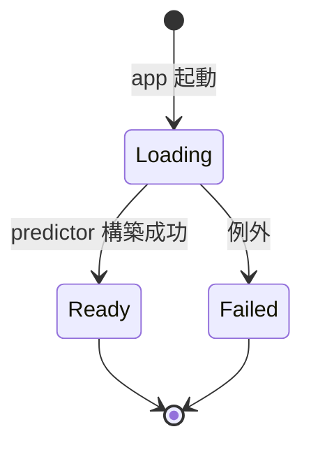

# 03. バックエンド仕様

## 3.1 概要

FastAPI で構築する HTTP サーバ。起動時に SAM2 モデルをバックグラウンドでロードし、フロントエンドからの mp4 アップロードと BBox 付き推論リクエストを受け付ける。レスポンスのマスクは **mp4 バイナリ** で返す。

参照実装: [`vendor/sam2/examples/segment_video_server.py`](../../vendor/sam2/examples/segment_video_server.py)

参照実装からの主な差分:
- 出力形式: RLE → **mp4 バイナリ**
- モデルロード: 即時グローバル変数化 → **起動時に非同期バックグラウンドロード + ロード状態の問い合わせ**
- ルーティング: 単一ファイル → **`routes/` 配下に分割**
- バリデーション: なし → **Pydantic スキーマで bbox や frame_idx を検証**

## 3.2 ディレクトリ／ファイル構成

[02-architecture.md](02-architecture.md#22-ディレクトリ構成) の `server/` を参照。

```
server/
├── __init__.py        # 空
├── main.py            # FastAPI 起動、ルータ登録、CORS、lifespan
├── model.py           # SAM2 のロード状態管理 + 設定値
├── session.py         # セッションスロット（常に最大1件）
├── video_io.py        # mp4 デコード、マスク → mp4 エンコード
├── routes/
│   ├── __init__.py
│   ├── health.py
│   ├── session.py
│   └── segment.py
└── schemas.py         # Pydantic スキーマ
```

## 3.3 設定

設定はすべて [`model.py`](../../server/model.py) の冒頭にモジュールレベル定数としてハードコードされている。環境変数による上書きは行わない。

| 定数 | 値 | 用途 |
|---|---|---|
| `SAM2_CFG` | `configs/sam2.1/sam2.1_hiera_l.yaml` | SAM2 設定ファイル（hydra で解決） |
| `SAM2_CKPT` | `<project_root>/vendor/sam2/checkpoints/sam2.1_hiera_large.pt` | チェックポイントの絶対パス（`__file__` 起点で解決） |
| `SAM2_DEVICE` | `cuda` | 推論デバイス |

ポートは `run.py` および `main.py` で `8000` にハードコード。バックエンドはローカル運用前提のシンプル構成。

## 3.4 モデルロード（`model.py`）

### 3.4.1 ロードのライフサイクル



### 3.4.2 状態保持

`ModelHolder` クラスがインスタンス（`model_holder`）として以下を保持する。

- `state`: `"loading" | "ready" | "failed"`
- `predictor`: SAM2 の `Sam2VideoPredictor`（ロード成功後）
- `error`: ロード失敗時のエラーメッセージ
- `_ready_event`: `asyncio.Event`（ロード完了シグナル）

`threading.Lock` は使わない。ロード完了時の状態更新はイベントループ上で行うため、複数スレッドから同時アクセスされない。

### 3.4.3 起動時のバックグラウンドロード

`main.py` の FastAPI lifespan で `asyncio.create_task(model_holder.load())` を呼ぶ。

```python
@asynccontextmanager
async def lifespan(app: FastAPI):
    asyncio.create_task(model_holder.load())
    yield
```

`load()` 内では `asyncio.to_thread(self._load_sync)` を使い、SAM2 のブロッキング初期化処理を worker thread に逃がしながら、状態更新（`_state` 設定や `_ready_event.set()`）はイベントループ上で安全に行う。

- 起動直後は `state = "loading"`。サーバはすぐにリクエストを受け付ける
- ロード完了で `state = "ready"`、`_ready_event.set()`
- ロード失敗で `state = "failed"`、`error` にメッセージ、`_ready_event.set()`

### 3.4.4 リクエスト処理時のロード待ち合わせ

`/session` および `/segment` のハンドラ冒頭で `wait_ready(timeout=5.0)` を呼ぶ。

```python
async def wait_ready(self, timeout: float | None = None) -> None:
    if self._state == "ready":
        return
    if self._state == "failed":
        raise RuntimeError(f"model failed to load: {self._error}")
    try:
        await asyncio.wait_for(self._ready_event.wait(), timeout=timeout)
    except asyncio.TimeoutError as exc:
        raise TimeoutError("model not ready (timeout)") from exc
    if self._state == "failed":
        raise RuntimeError(...)
```

ハンドラ側では `TimeoutError` / `RuntimeError` を 503 に変換。タイムアウトはハードコードで 5.0 秒（[04-api.md §4.7](04-api.md#47-タイムアウト方針)）。

`/health` はこの待ち合わせを行わず、現在の `state` をそのまま返す。

## 3.5 セッション管理（`session.py`）

### 3.5.1 データ構造

```python
@dataclass
class Session:
    inference_state: Any           # SAM2 predictor の state
    video_path: str                # 一時ファイルへの絶対パス
    width: int
    height: int
    fps: float
    num_frames: int
    created_at: float
```

`SessionSlot` クラスが現在のセッション 1 件のみを保持する単一スロット (`Session | None`) を持ち、`threading.Lock` でスレッドセーフに操作する（FastAPI が同期ハンドラをスレッドプールで処理する場合、および推論リクエストと並行して新規 `/session` が来る場合に備えて）。

セッションは ID で識別しない。クライアントとサーバーは「常に最大 1 件のセッションが存在する」前提を共有し、`session_id` のやり取りは行わない。

公開 API:

| メソッド | 役割 |
|---|---|
| `replace(...)` | 新規セッションをスロットに投入。直前のセッションがあれば破棄（一時ファイル削除）してから差し替える |
| `current() -> Session \| None` | 現在のセッションを取得。存在しなければ `None` |
| `is_active() -> bool` | セッションが存在するか |

### 3.5.2 ライフタイム

- 作成・差し替え: `/session` が呼ばれるたびに `SessionSlot.replace()` が走り、直前のセッションは自動破棄される
- 明示削除エンドポイントは MVP では設けない（要件上、新規 `/session` で旧セッションが必ず置き換わるため不要）
- サーバ起動直後はセッションなし（`current() is None`）。`/segment` を呼ばれた場合は 409 を返す

### 3.5.3 一時ファイルの扱い

mp4 はサーバの一時ディレクトリに保存し、`Session.video_path` から絶対パスで参照する。SAM2 の `init_state(video_path=...)` がファイルパスを要求するため。

`SessionSlot.replace()` で旧セッションが置き換わった際、`Session.video_path` の一時ファイルも削除する。削除はロック外で実行し、ロック保持時間を最小化する。削除失敗（権限なし・既に削除済み等）は警告ログだけ出して握り潰し、スロットの整合性を優先する。

## 3.6 動画 I/O（`video_io.py`）

### 3.6.1 メタ情報取得

mp4 ファイルパスを受けて、`VideoMetadata`（`width / height / fps / num_frames`）を返す `probe_video()` を提供。OpenCV の `VideoCapture` で実装。

### 3.6.2 マスク → mp4 エンコード

SAM2 の出力（フレームごとの 2D bool ndarray）を H.264 mp4 にエンコードする `encode_masks_to_mp4()` を提供。

- カラー: グレースケール（白=マスク領域、黒=非マスク領域）として生成
- 解像度: 元動画と同じ（H.264 の偶数次元制約で奇数サイズは 1px 拡張してパディング）
- fps: **常に元動画と同じ**（セッションから取得）
- コーデック: **H.264 / libx264 (yuv420p) 固定**。ブラウザ互換のため `mp4v`（MPEG-4 Part 2）は使わない
- フレーム順序: フレーム番号昇順（SAM2 が生成しなかったフレームは黒フレームで補完）

エンコード手順:
1. 各フレームを PNG として一時ディレクトリに書き出す
2. `ffmpeg -c:v libx264 -pix_fmt yuv420p -crf 18 -preset fast` で mp4 に変換
3. ffmpeg が PATH にない場合は OpenCV の `avc1` fourcc にフォールバック
4. 一時ファイルは処理後に削除

### 3.6.3 マスクシグナル定義

フロントエンドはマスク mp4 のピクセル値を以下のように解釈する（[07-pixi-canvas.md](07-pixi-canvas.md) 参照）。

- 輝度 ≧ 128: マスク領域（重畳対象）
- 輝度 < 128: 非マスク領域（透過）

## 3.7 ルーティング

詳細スキーマは [04-api.md](04-api.md) に定義。本節は責務のみ。

| パス | メソッド | 概要 |
|---|---|---|
| `/health` | GET | サーバ稼働確認 + モデルロード状態 |
| `/session` | POST | mp4 アップロード → セッション作成 |
| `/segment` | POST | frame_idx + bbox → マスク mp4（現在のセッションを暗黙利用） |

各エンドポイントは `server/routes/` 配下の個別ファイルで `APIRouter` として定義し、`main.py` が `include_router` でまとめて登録する。

### 3.7.1 `/session` の処理フロー

1. `wait_ready(5.0)` でモデルロード完了を待ち合わせ
2. multipart で受け取った mp4 を一時ファイルに保存
3. `probe_video()` でメタ情報を取得
4. `predictor.init_state(video_path=...)` で `inference_state` 構築
5. `SessionSlot.replace()` で旧セッションを破棄しつつ新規 `Session` をスロットに配置
6. `videoMeta` を JSON で返す（Pydantic の `alias_generator=to_camel` により snake_case の Python 属性が camelCase に変換される）

### 3.7.2 `/segment` の処理フロー

1. `wait_ready(5.0)` でモデルロード完了を待ち合わせ
2. `SessionSlot.current()` で現在のセッションを取得（無ければ 409）
3. `frame_idx` の範囲チェック（無効なら 422）
4. `predictor.reset_state(state)` で前回結果をクリア
5. `predictor.add_new_points_or_box(frame_idx, obj_id=0, box=...)`
6. 順方向と逆方向の `propagate_in_video` を実行し、フレーム別マスクを取得
7. SAM2 が生成しなかったフレームを黒で埋めて `masks_in_order` を作成
8. `encode_masks_to_mp4()` で mp4 にエンコード（fps はセッションから取得）
9. mp4 バイナリを `video/mp4` で返す

順方向＋逆方向の伝播は参照実装と同じ。

## 3.8 エラー処理

| 状況 | HTTP | エラー内容 |
|---|---|---|
| モデルロード未完了でタイムアウト | 503 | `model not ready (timeout)` |
| モデルロード失敗 | 503 | `model failed to load: <message>` |
| `/segment` 時にセッションが存在しない | 409 | `no active session` |
| `frame_idx` が範囲外 | 422 | `frame_idx out of range: ...` |
| `bbox` の値が不正（長さ・座標） | 422 | Pydantic バリデーション |
| mp4 が読み込めない | 400 | `cannot open video: ...` |
| 内部例外 | 500 | `segmentation failed` 等 |

ロード待ちのタイムアウトは 5 秒。これを超えるとフロントエンドは 503 を受け取り、エラー表示する。

## 3.9 CORS

`main.py` で `CORSMiddleware` を `allow_origins=["*"]`（全許可）で登録する。サーバ自体にネットワーク・ファイアウォール等のアクセス制限をかける前提のため、CORS 側はゆるく開放する。

## 3.10 実装チェックリスト

- [ ] `server/` のファイル構成が本仕様と一致
- [ ] FastAPI 起動時に `asyncio.create_task(model_holder.load())` でロードが開始される
- [ ] モデルロード未完了でも `/health` は応答する
- [ ] モデルロード未完了の場合、`/session` と `/segment` は最大 5 秒待機して 503 を返す
- [ ] `/session` で受け取った mp4 を一時ファイルに保存し、`init_state` を呼ぶ
- [ ] `/session` のレスポンスは `videoMeta` のみを含む（`session_id` は返さない）
- [ ] `/session` を再度呼ぶと `SessionSlot.replace()` が走り、旧セッションと一時ファイルが破棄される
- [ ] `/segment` でマスクを mp4 にエンコードし、`video/mp4` バイナリで返す
- [ ] `/segment` をセッション未作成で呼ぶと 409 を返す
- [ ] 一時ファイルがセッション差し替え時に削除される
