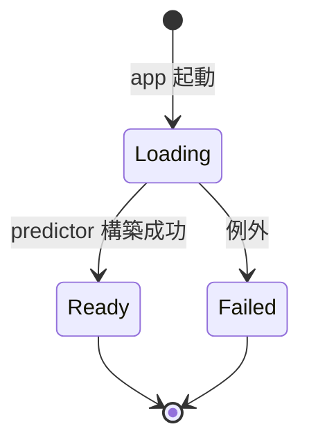
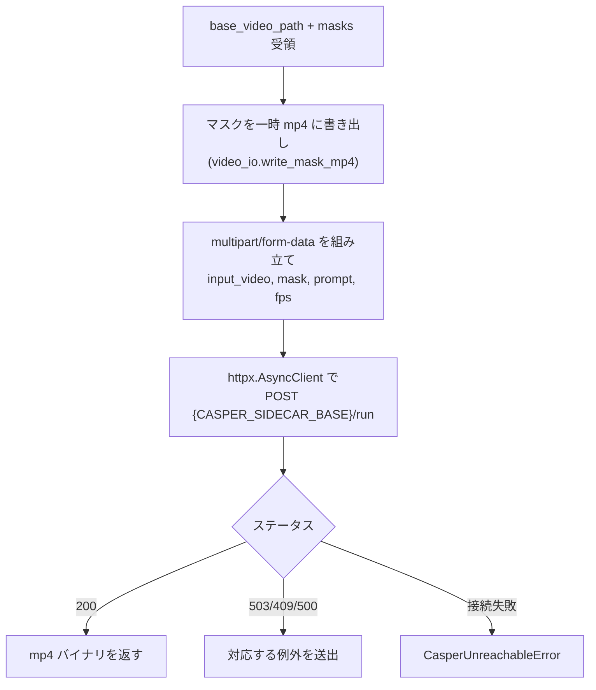
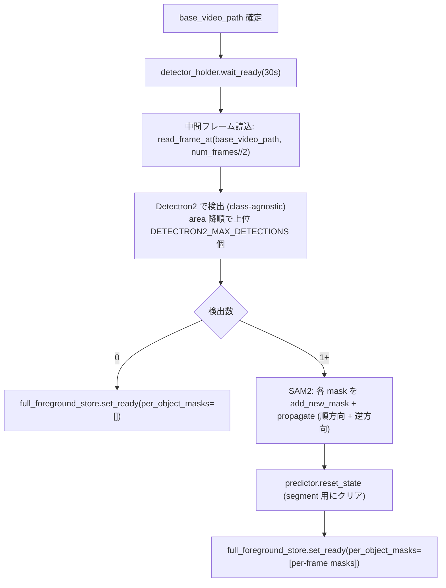
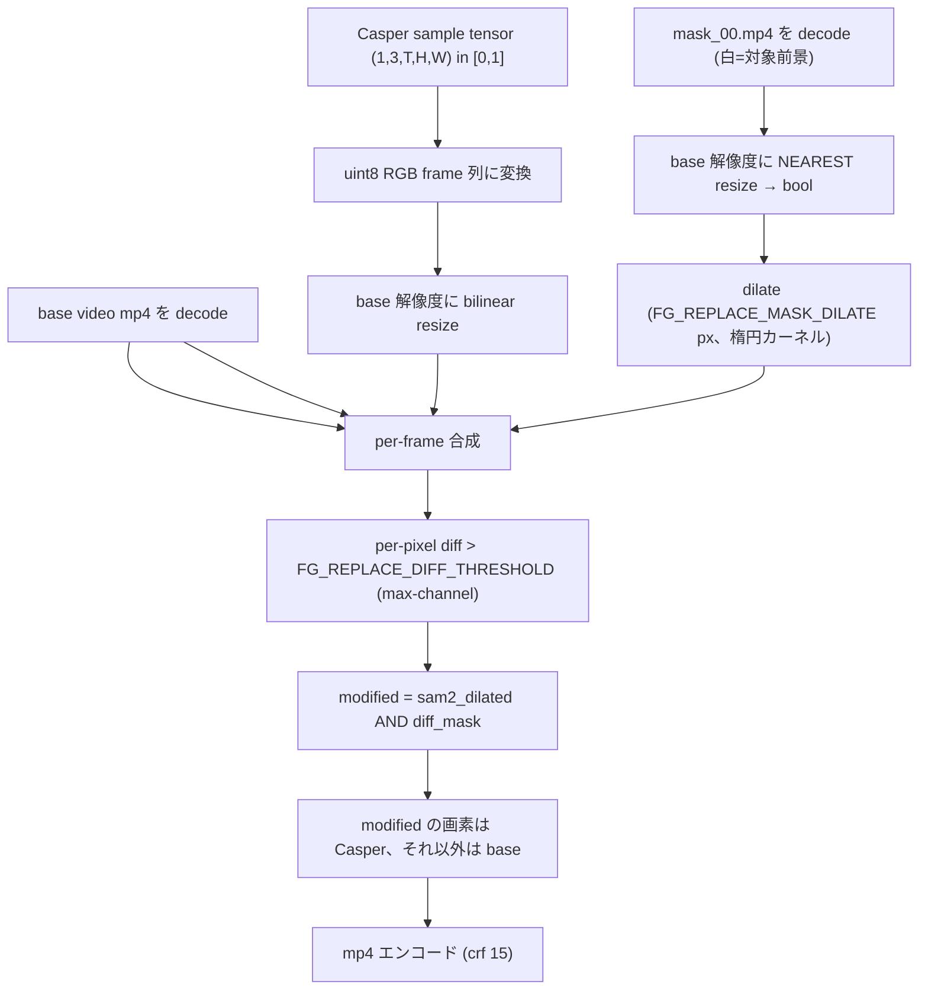

# 03. バックエンド仕様

## 3.1 概要

FastAPI で構築する HTTP サーバ。**本サーバ（SAM2 担当, `:8000`）** と **Casper Sidecar（前景削除担当, `:8765`）** の 2 プロセス構成で、両方とも起動時にモデルをプリロードする。

本サーバは、フロントエンドからの mp4 アップロードと BBox 付き推論リクエストを受け付ける。`/segment` のレスポンスは **base video にマスクを半透明＋着色合成した mp4 バイナリ**（マスク単体ではなく合成済み）。

`/remove` は SAM2 で得たマスクを使って base video から前景物体を削除する。本サーバは Casper を直接走らせず、**HTTP で sidecar の `/run` を呼ぶ**。sidecar は `vendor/gen-omnimatte-public` の Casper（Wan2.1-1.3B）を **起動時にプリロード** しているため、`/remove` の応答時間は Casper 推論時間のみで済む。

sidecar は本サーバの lifespan が自動 spawn する。フロントから sidecar は見えない（[01-overview.md §1.5](01-overview.md#15-動作モード) と [02-architecture.md §2.1](02-architecture.md#21-システム構成) 参照）。

参照実装: [`vendor/sam2/examples/segment_video_server.py`](../../vendor/sam2/examples/segment_video_server.py)

参照実装からの主な差分:
- 出力形式: RLE → **マスクをサーバ側で原動画に半透明合成した mp4 バイナリ**
- モデルロード: 即時グローバル変数化 → **起動時に非同期バックグラウンドロード + ロード状態の問い合わせ**
- ルーティング: 単一ファイル → **`routes/` 配下に分割**
- バリデーション: なし → **Pydantic スキーマで bbox や frame_idx を検証**

## 3.2 ディレクトリ／ファイル構成

[02-architecture.md](02-architecture.md#22-ディレクトリ構成) の `server/` を参照。

```
server/                       # 本サーバ
├── __init__.py               # 空
├── main.py                   # FastAPI 起動、CORS、lifespan で SAM2 / Detectron2 ロード + sidecar spawn
├── model.py                  # SAM2 / Casper / Detectron2 設定値
├── session.py                # セッションスロット（base_video_path / inference_state）+ swap_base_video
├── mask_store.py             # 直近 trimask の単一スロット（/remove で sidecar に渡す）
├── full_foreground_store.py  # base video 全体の全前景マスク（R-CNN + SAM2 propagation 結果）
├── detector.py               # Detectron2 (COCO Mask R-CNN) ホルダ。class-agnostic 検出
├── casper_client.py          # sidecar への HTTP クライアント（httpx）
├── video_io.py               # mp4 デコード、合成 mp4 エンコード、trimask → mp4 エンコード、フレーム抽出
├── routes/
│   ├── __init__.py
│   ├── health.py
│   ├── session.py
│   ├── segment.py
│   └── removal.py
└── schemas.py                # Pydantic スキーマ

casper_server/             # Casper sidecar
├── __init__.py            # 空
├── main.py                # FastAPI 起動、lifespan で Casper プリロード
├── holder.py              # CasperHolder（loading/ready/failed）
├── pipeline.py            # gen-omnimatte-public の load_pipeline / run_inference を absl 非依存で再実装
├── runner.py              # /run と /preload で共有する pipeline 実行ヘルパ + run_lock
├── output_cache.py        # 出力 mp4 のキャッシュ（key = video md5 + mask md5）
└── routes/
    ├── __init__.py
    ├── health.py
    ├── run.py             # POST /run（cache hit 時は即返す）
    └── preload.py         # POST /preload（先回り推論を 202 即時応答 + バックグラウンド実行）
```

## 3.3 設定

モデル関連の設定は [`model.py`](../../server/model.py) の冒頭にモジュールレベル定数としてハードコードされている。

| 定数 | 値 | 用途 |
|---|---|---|
| `SAM2_CFG` | `configs/sam2.1/sam2.1_hiera_l.yaml` | SAM2 設定ファイル（hydra で解決） |
| `SAM2_CKPT` | `<project_root>/vendor/sam2/checkpoints/sam2.1_hiera_large.pt` | チェックポイントの絶対パス（`__file__` 起点で解決） |
| `SAM2_DEVICE` | `cuda` | 推論デバイス |
| `DETECTRON2_CONFIG` | `COCO-InstanceSegmentation/mask_rcnn_R_50_FPN_3x.yaml` | COCO Mask R-CNN の config（model_zoo 指定） |
| `DETECTRON2_DEVICE` | `cuda` | 検出推論デバイス |
| `DETECTRON2_SCORE_THRESH` | `0.5` | 検出スコアのしきい値（COCO 既定） |
| `DETECTRON2_MAX_DETECTIONS` | `5` | 検出物体の上限。area 降順で上位 N 個を採用 |
| `DETECTRON2_MIN_AREA_RATIO` | `0.001` | 画像面積の 0.1% 未満は誤検出として除外 |
| `DETECTRON2_IOU_WITH_TARGET` | `0.3` | 対象前景との IoU がこれを超えた検出は対象本人として除外 |

Casper（前景削除）関連の値はハードコードで、本サーバ・sidecar の双方から `server/model.py` を import して参照する。

| 定数 | 値 | 用途 |
|---|---|---|
| `CASPER_REPO_DIR` | `<project_root>/vendor/gen-omnimatte-public` | Casper リポジトリのルート（`__file__` 起点） |
| `CASPER_TRANSFORMER_PATH` | `<CASPER_REPO_DIR>/models/Casper/wan2.1_fun_1.3b_casper.safetensors` | Casper の重みファイル（リポジトリの実ファイル名に合わせる） |
| `CASPER_CONFIG_PATH` | `config/default_wan.py` | ベース config（リポジトリ相対） |
| `CASPER_FPS` | `8` | 出力 fps |
| `CASPER_NUM_INFERENCE_STEPS` | `1` | サンプリングステップ数 |
| `CASPER_TEMPORAL_WINDOW_SIZE` | `21` | 一度に処理するフレーム数 |
| `CASPER_MATTING_MODE` | `"all_fg"` | すべての前景を削除（マスク領域＝物体すべて） |
| `CASPER_DEFAULT_PROMPT` | `"a clean background video."` | sidecar に送るプロンプトの既定値 |
| `FOREGROUND_ONLY_REPLACE` | `False`（環境変数 `OMNIMATTE_FOREGROUND_ONLY_REPLACE`、`1` で有効化） | sidecar 内で「前景部分のみ Casper 出力で書き換え、残りは base video 画素を保持」する後処理を行うかどうか。既定では Casper の生出力がそのまま返る |
| `FG_REPLACE_DIFF_THRESHOLD` | `10`（`OMNIMATTE_FG_REPLACE_DIFF_THRESHOLD`） | 判定マスクの per-channel 差分しきい値（0-255）。SAM2 マスク（dilate 後）と AND を取る |
| `FG_REPLACE_MASK_DILATE` | `11`（`OMNIMATTE_FG_REPLACE_MASK_DILATE`） | SAM2 マスクの dilate ピクセル数。Casper の `cfg.data.dilate_width=11` と整合 |

sidecar との通信は環境変数で制御する。

| 環境変数 | 既定値 | 用途 |
|---|---|---|
| `OMNIMATTE_CASPER_PORT` | `8765` | sidecar のリッスンポート |
| `CASPER_SIDECAR_BASE` | `http://127.0.0.1:{OMNIMATTE_CASPER_PORT}` | 本サーバ → sidecar の HTTP ベース URL |
| `OMNIMATTE_SPAWN_CASPER` | `1` | `0` のとき本サーバ lifespan で sidecar を spawn しない（クラウド分離・デバッグ用） |
| `CASPER_STARTUP_TIMEOUT_SEC` | `5.0` | `/remove` で sidecar の `state="ready"` を待つ最大秒数（SAM2 と統一） |

起動関連は [`run.py`](../../run.py) で扱う。

| 項目 | 指定方法 | 既定 |
|---|---|---|
| バインドアドレス | ハードコード `127.0.0.1` | — |
| リッスンポート | `OMNIMATTE_PORT` 環境変数 | `8000` |

バックエンドは原則ローカル待ち受け。クラウド GPU サーバ運用時はクライアント側で SSH ポート転送（`ssh -L 8000:127.0.0.1:8000 ...`）を張って接続する。アプリ側に認証層は持たず、アクセス制御はサーバの SSH/ファイアウォール設定で担保する。

## 3.4 モデルロード（`model.py`）

### 3.4.1 ロードのライフサイクル



### 3.4.2 状態保持

`ModelHolder` クラスがインスタンス（`model_holder`）として以下を保持する。

- `state`: `"loading" | "ready" | "failed"`
- `predictor`: SAM2 の `Sam2VideoPredictor`（ロード成功後）
- `error`: ロード失敗時のエラーメッセージ
- `_ready_event`: `asyncio.Event`（ロード完了シグナル）

`threading.Lock` は使わない。ロード完了時の状態更新はイベントループ上で行うため、複数スレッドから同時アクセスされない。

### 3.4.3 起動時のバックグラウンドロード

`main.py` の FastAPI lifespan で `asyncio.create_task(model_holder.load())` を呼ぶ。

```python
@asynccontextmanager
async def lifespan(app: FastAPI):
    asyncio.create_task(model_holder.load())
    yield
```

`load()` 内では `asyncio.to_thread(self._load_sync)` を使い、SAM2 のブロッキング初期化処理を worker thread に逃がしながら、状態更新（`_state` 設定や `_ready_event.set()`）はイベントループ上で安全に行う。

- 起動直後は `state = "loading"`。サーバはすぐにリクエストを受け付ける
- ロード完了で `state = "ready"`、`_ready_event.set()`
- ロード失敗で `state = "failed"`、`error` にメッセージ、`_ready_event.set()`

### 3.4.4 リクエスト処理時のロード待ち合わせ

`/session` および `/segment` のハンドラ冒頭で `wait_ready(timeout=5.0)` を呼ぶ。

```python
async def wait_ready(self, timeout: float | None = None) -> None:
    if self._state == "ready":
        return
    if self._state == "failed":
        raise RuntimeError(f"model failed to load: {self._error}")
    try:
        await asyncio.wait_for(self._ready_event.wait(), timeout=timeout)
    except asyncio.TimeoutError as exc:
        raise TimeoutError("model not ready (timeout)") from exc
    if self._state == "failed":
        raise RuntimeError(...)
```

ハンドラ側では `TimeoutError` / `RuntimeError` を 503 に変換。タイムアウトはハードコードで 5.0 秒（[04-api.md §4.7](04-api.md#47-タイムアウト方針)）。

`/health` はこの待ち合わせを行わず、現在の `state` をそのまま返す。

## 3.5 セッション管理（`session.py`）

### 3.5.1 データ構造

```python
@dataclass
class Session:
    inference_state: Any           # SAM2 predictor の state
    base_video_path: str           # 現在のベース動画への絶対パス（初回は原動画、/remove 完了後は前景削除結果）
    width: int
    height: int
    fps: float
    num_frames: int
    created_at: float
```

`SessionSlot` クラスが現在のセッション 1 件のみを保持する単一スロット (`Session | None`) を持ち、`threading.Lock` でスレッドセーフに操作する（FastAPI が同期ハンドラをスレッドプールで処理する場合、および推論リクエストと並行して新規 `/session` が来る場合に備えて）。

セッションは ID で識別しない。クライアントとサーバーは「常に最大 1 件のセッションが存在する」前提を共有し、`session_id` のやり取りは行わない。

公開 API:

| メソッド | 役割 |
|---|---|
| `replace(...)` | 新規セッションをスロットに投入。直前のセッションがあれば破棄（base video の一時ファイル削除）してから差し替える |
| `swap_base_video(new_video_path, new_meta, new_inference_state)` | `/remove` 完了時にベース動画を差し替える。旧 base video のファイルを削除し、`inference_state` を新動画で再構築した値を採用し、`width / height / fps / num_frames` を新メタで上書きする。`MaskStore.clear()` も併せて呼ぶ |
| `current() -> Session \| None` | 現在のセッションを取得。存在しなければ `None` |
| `is_active() -> bool` | セッションが存在するか |

> **注**: 既存実装で `Session.video_path` だったフィールドは `base_video_path` に改名する。意味は「現在のベース動画のパス」であり、`/remove` ごとに新動画パスへ差し替わる。

### 3.5.2 ライフタイム

- 作成・差し替え: `/session` が呼ばれるたびに `SessionSlot.replace()` が走り、直前のセッションは自動破棄される
- ベース動画の差し替え: `/remove` 完了時に `SessionSlot.swap_base_video()` が走り、旧ベース動画ファイル削除 → 新ベース動画で `init_state` 再構築 → `MaskStore.clear()` を行う
- 明示削除エンドポイントは MVP では設けない（要件上、新規 `/session` で旧セッションが必ず置き換わるため不要）
- サーバ起動直後はセッションなし（`current() is None`）。`/segment` または `/remove` を呼ばれた場合は 409 を返す

### 3.5.3 一時ファイルの扱い

mp4 はサーバの一時ディレクトリに保存し、`Session.base_video_path` から絶対パスで参照する。SAM2 の `init_state(video_path=...)` がファイルパスを要求するため。

`SessionSlot.replace()` または `SessionSlot.swap_base_video()` で旧 base video が置き換わった際、対応する一時ファイルも削除する。削除はロック外で実行し、ロック保持時間を最小化する。削除失敗（権限なし・既に削除済み等）は警告ログだけ出して握り潰し、スロットの整合性を優先する。

### 3.5.4 MaskStore（`mask_store.py`）

`/segment` 完了時に、`composite_overlay_to_mp4` の入力となった `masks_in_order`（`np.ndarray[T, H, W] of bool`）を保持する単一スロット。

```python
@dataclass
class MaskRecord:
    masks: np.ndarray              # (T, H, W) bool。base video の解像度・フレーム数と一致
    base_video_path: str           # マスク生成時点の base video パス（整合性チェック用）
    fps: float                     # マスク生成時点の fps（マスク mp4 化に使う）
    created_at: float

class MaskStore:
    def set(self, record: MaskRecord) -> None: ...
    def current(self) -> MaskRecord | None: ...
    def clear(self) -> None: ...
```

- 直近 1 件のみ保持。`/segment` のたびに上書き、`/remove` 成功時 / `/session` 差し替え時にクリア。
- 永続化はしない（メモリ常駐）。

### 3.5.5 Casper Client（`casper_client.py`）

`/remove` ハンドラから呼び出される、sidecar への HTTP クライアント。

```python
class CasperUnreachableError(Exception): ...
class CasperBusyError(Exception): ...
class CasperRunError(Exception): ...

async def run_casper(
    base_video_path: str,
    masks: np.ndarray,           # (T, H, W) bool
    fps: float,
) -> bytes:
    """sidecar に POST /run して mp4 バイナリを返す。失敗時は例外。"""
```

処理フロー:



実装上の留意点:
- HTTP クライアントは `httpx.AsyncClient`（`requirements.txt` に追加）
- 接続タイムアウトは 5 秒、**読み取りタイムアウトは無し**（Casper 推論は数分かかり得る）
- 一時マスク mp4 は処理後に削除する
- sidecar 側の `409 another run is in progress` は `CasperBusyError`、`503` は `CasperUnreachableError` 系として上位に伝搬

マスクの mp4 化:
- `masks` (`bool[T, H, W]`) を `uint8 * 255` に変換し、3ch にブロードキャスト、ベース動画の解像度・fps で mp4 にエンコードする（`video_io.write_mask_mp4(masks, fps, out_path)`）
- 全フレーム必須（SAM2 で生成しなかったフレームは全黒で埋められた状態で MaskStore に入っている）

## 3.6 動画 I/O（`video_io.py`）

### 3.6.1 メタ情報取得

mp4 ファイルパスを受けて、`VideoMetadata`（`width / height / fps / num_frames`）を返す `probe_video()` を提供。OpenCV の `VideoCapture` で実装。

### 3.6.2 base video＋マスクの合成 mp4 エンコード

`composite_overlay_to_mp4(original_video_path, masks_in_order, fps, ...)` を提供。base video の各フレームに対し、マスク領域だけを半透明色でアルファブレンドした mp4 を返す。

採用理由: フロントエンドが `<video>` 1 本で再生するだけになり、原動画とマスク動画を別々にデコードしたときに発生するデコーダ間のドリフトが原理的に発生しない。

仕様:
- 出力: 原動画の上に `overlay_color_bgr` （既定 `(64, 64, 255)`）を `overlay_alpha`（既定 `0.5`）で半透明合成。マスク非該当領域は原動画そのまま
- 解像度: 元動画と同じ（H.264 の偶数次元制約で奇数サイズは右下を 1px 拡張してパディング）
- fps: **常に元動画と同じ**（セッションから取得）
- コーデック: **H.264 / libx264 (yuv420p, crf 18, preset fast) 固定**
- フレーム順序: フレーム番号昇順（SAM2 が生成しなかったフレームは原動画フレームをそのまま使う）

エンコード手順:
1. OpenCV `VideoCapture` で base video を 1 フレームずつ読み出す
2. 各フレームに対しマスク領域だけアルファブレンドした合成フレームを作る
3. PNG として一時ディレクトリに書き出す
4. `imageio_ffmpeg.get_ffmpeg_exe()` 経由で `ffmpeg -c:v libx264 -pix_fmt yuv420p -crf 18 -preset fast` を呼び出して mp4 化
5. 一時ファイルは処理後に削除

### 3.6.3 マスクの mp4 書き出し

`write_mask_mp4(masks, fps, out_path)` を提供。Casper Runner が一時シーケンスディレクトリに `mask_00.mp4` を配置するために使う。

仕様:
- 入力: `masks: np.ndarray[T, H, W] of bool`、`fps: float`、`out_path: str`
- 出力: 白（255, 255, 255）が前景、黒（0, 0, 0）が背景の 3ch mp4。base video と同じ解像度・fps
- コーデック: H.264 / yuv420p / crf 18 / preset fast（合成 mp4 と統一）

## 3.7 ルーティング

詳細スキーマは [04-api.md](04-api.md) に定義。本節は責務のみ。

| パス | メソッド | 概要 |
|---|---|---|
| `/health` | GET | サーバ稼働確認 + モデルロード状態 |
| `/session` | POST | mp4 アップロード → セッション作成 |
| `/segment` | POST | frame_idx + bbox → base video＋マスク半透明合成済み mp4。完了時にマスクを `MaskStore` に保存 |
| `/remove` | POST | 直近 SAM2 マスクで base video から前景削除 → 削除後 mp4。完了時にセッションのベース動画を新動画に差し替え、`MaskStore` をクリア |

各エンドポイントは `server/routes/` 配下の個別ファイルで `APIRouter` として定義し、`main.py` が `include_router` でまとめて登録する。

### 3.7.1 `/session` の処理フロー

1. `wait_ready(5.0)` で SAM2 のロード完了を待ち合わせ
2. multipart で受け取った mp4 を一時ファイルに保存
3. `probe_video()` でメタ情報を取得
4. `predictor.init_state(video_path=...)` で `inference_state` 構築
5. `SessionSlot.replace()` で旧セッションを破棄しつつ新規 `Session` をスロットに配置
6. `mask_store.clear()`、`full_foreground_store.start_loading()`
7. **バックグラウンドタスク** として全前景抽出を起動（`asyncio.create_task`）。後述 [3.7.4](#374-全前景抽出のバックグラウンド処理)
8. `videoMeta` を JSON で返す（Pydantic の `alias_generator=to_camel` により snake_case の Python 属性が camelCase に変換される）

`/session` 自体は全前景抽出の完了を待たない。後続の `/segment` が `full_foreground_store.wait_ready()` で待機する。

### 3.7.2 `/segment` の処理フロー

1. `wait_ready(5.0)` で SAM2 のロード完了を待ち合わせ
2. `SessionSlot.current()` で現在のセッションを取得（無ければ 409）
3. `frame_idx` の範囲チェック（無効なら 422）
4. **`full_foreground_store.wait_ready(timeout=600.0)` で全前景抽出の完了を待機**（バックグラウンドで進行中の場合あり）
5. `predictor.reset_state(state)` で前回結果をクリア
6. `predictor.add_new_points_or_box(frame_idx, obj_id=0, box=...)`
7. 順方向と逆方向の `propagate_in_video` を実行し、フレーム別マスク `masks_target (T,H,W) bool` を取得
8. **R-CNN 検出物体から対象を除外**: 各 R-CNN 物体について `IoU(target_at_frame_idx, obj_at_frame_idx) > DETECTRON2_IOU_WITH_TARGET` ならスキップ。残りを OR して `other_fg_combined (T,H,W) bool`
9. **trimask 構築** (`(T, H, W) uint8`、Casper の trimask 規約に合わせた値):
   - 既定: `128`（neutral / 背景）
   - `other_fg_combined & ~masks_target`: `255`（keep / 他の前景）
   - `masks_target`: `0`（remove / 対象前景）
10. `MaskStore.set(trimask=trimask, base_video_path=session.base_video_path, fps=session.fps)`
11. `composite_overlay_to_mp4()` で base video＋対象マスク半透明合成 mp4 を作成（fps はセッションから取得）
12. **`asyncio.create_task(preload_casper(...))`** で sidecar に先回り推論を依頼（投げ捨て）
13. mp4 バイナリを `video/mp4` で返す

順方向＋逆方向の伝播は参照実装と同じ。

### 3.7.3 `/remove` の処理フロー

1. `model_holder.wait_ready(5.0)` で SAM2 ロード完了を待ち合わせ
2. `SessionSlot.current()` でセッション取得（無ければ 409: `no active session`）
3. `MaskStore.current()` で trimask 取得（無ければ 409: `no segmentation result available`）
4. trimask の `base_video_path` が現在のセッションの `base_video_path` と一致することを確認（不一致なら 409: `mask is stale`）
5. `casper_client.run_casper(base_video_path, trimask, fps, width, height)` を呼び、sidecar の `POST /run` を待つ（cache hit なら即返る）
   - `CasperUnreachableError` → 503 `casper sidecar unreachable`
   - `CasperBusyError` → 409 `another removal is in progress`
   - `CasperRunError` → 500 `casper run failed: ...`
6. レスポンスの mp4 バイナリを一時ファイルに書き出す
7. `probe_video()` でメタ情報を取得
8. `predictor.init_state(new_base_video_path)` で `inference_state` を再構築
9. `SessionSlot.swap_base_video(new_base_video_path, new_inference_state, ...)` でベース動画を差し替え。内部で旧 base video を削除する
10. `MaskStore.clear()` で trimask を破棄
11. **`full_foreground_store.start_loading()` + バックグラウンドで全前景抽出を再起動**（新しい base video に対する R-CNN + propagate）
12. 出力 mp4 をバイナリで返す（`video/mp4`）

> **注**: 同じセッションでベース動画を差し替えるため、フロントエンドからは `/session` を呼び直さない。`/remove` レスポンスがそのまま新しい base video として扱われる。
>
> Casper の重みファイル不在チェックは sidecar 側のロード時に行う（不在なら sidecar の `casper_state` が `failed` になり、本サーバの `/remove` は 503 を返す）。

### 3.7.4 全前景抽出のバックグラウンド処理

`/session` 完了直後と `/remove` 完了直後に、現在の base video に対して以下のバックグラウンドタスクが起動する。



失敗時は `full_foreground_store.set_failed(error)` に遷移し、後続の `/segment` は 503 を返す。

`/segment` 側は `wait_ready(timeout=600s)` でこの完了を待つ。バックグラウンド処理が走っている最中に `/segment` が来た場合、自然に待機する。

`/segment` 側は `wait_ready(timeout=600s)` でこの完了を待つ。バックグラウンド処理が走っている最中に `/segment` が来た場合、自然に待機する。

## 3.8 エラー処理

| 状況 | HTTP | エラー内容 |
|---|---|---|
| モデルロード未完了でタイムアウト | 503 | `model not ready (timeout)` |
| モデルロード失敗 | 503 | `model failed to load: <message>` |
| `/segment` または `/remove` 時にセッションが存在しない | 409 | `no active session` |
| `/segment` 時に全前景抽出が未完了でタイムアウト | 503 | `full foreground extraction not ready (timeout)` |
| `/segment` 時に全前景抽出が失敗 | 503 | `full foreground extraction failed: ...` |
| `/segment` 時に全前景データが古い base video のもの | 409 | `full foreground data is stale` |
| `/remove` 時に SAM2 結果が手元にない | 409 | `no segmentation result available` |
| `/remove` 時に保持マスクが古い base video のもの | 409 | `mask is stale` |
| `/remove` 時に sidecar に接続できない | 503 | `casper sidecar unreachable` |
| `/remove` 時に sidecar が他のジョブで処理中 | 409 | `another removal is in progress` |
| `/remove` 時に sidecar の Casper モデル未準備（重み未配置含む） | 503 | sidecar の `/health` の `casper_state` が `failed` を返す（`casper not ready` / `casper failed to load: ...`） |
| `frame_idx` が範囲外 | 422 | `frame_idx out of range: ...` |
| `bbox` の値が不正（長さ・座標） | 422 | Pydantic バリデーション |
| mp4 が読み込めない | 400 | `cannot open video: ...` |
| sidecar 内部の Casper 推論が異常終了 | 500 | `casper run failed: <stderr 抜粋>` |
| 内部例外 | 500 | `segmentation failed` 等 |

ロード待ちのタイムアウトは 5 秒。これを超えるとフロントエンドは 503 を受け取り、エラー表示する。

## 3.9 CORS

`main.py` で `CORSMiddleware` を `allow_origins=["*"]`（全許可）で登録する。サーバ自体にネットワーク・ファイアウォール等のアクセス制限をかける前提のため、CORS 側はゆるく開放する。

## 3.10 Casper Sidecar 仕様（`casper_server/`）

Casper（前景削除）専用の小さな FastAPI。`vendor/gen-omnimatte-public` のパイプラインを **起動時にプリロード** し、本サーバから HTTP で呼ばれる。

### 3.10.1 起動方式

- 本サーバ lifespan で `subprocess.Popen([sys.executable, "-m", "casper_server.main"], env=...)` で spawn される（`OMNIMATTE_SPAWN_CASPER=1` 既定）
- 単独起動も可能: `python run_casper.py`
- リッスンアドレス: `127.0.0.1:{OMNIMATTE_CASPER_PORT}`（既定 `8765`）。`0.0.0.0` には bind しない
- 標準出力・標準エラーは本サーバが `[casper] ` プレフィクス付きでメインログに混ぜる

### 3.10.2 CasperHolder（`casper_server/holder.py`）

[`ModelHolder`](#34-モデルロードmodelpy) と同パターン。

| 項目 | 内容 |
|---|---|
| `state` | `"loading" \| "ready" \| "failed"` |
| `pipeline` | `WanFunInpaintPipeline`（ロード成功後） |
| `vae`, `generator` | 同上（`load_pipeline` の戻り値を保持） |
| `error` | ロード失敗時のメッセージ |
| `_ready_event` | `asyncio.Event` |
| `wait_ready(timeout)` | SAM2 と同じシグネチャ。`/run` ハンドラ冒頭で `CASPER_STARTUP_TIMEOUT_SEC` 秒待つ |

lifespan で `asyncio.create_task(casper_holder.load())` で非同期ロード開始。`load()` 内では `asyncio.to_thread(self._load_sync)` で `pipeline.load_pipeline(...)` を worker thread に逃がす。

重みファイル `CASPER_TRANSFORMER_PATH` 不在は `_load_sync` 冒頭でチェックし、`state="failed"` に遷移させる。

### 3.10.3 Pipeline ラッパ（`casper_server/pipeline.py`）

`vendor/gen-omnimatte-public/inference/wan2.1_fun/predict_v2v.py` の `load_pipeline` / `run_inference` 相当を、**`absl.app.run` / `absl.flags` から切り離した import 可能関数として再実装する**。

| 関数 | 概要 |
|---|---|
| `build_default_config() -> ConfigDict` | `gen-omnimatte-public/config/default_wan.py` を `ml_collections` で読み、本仕様の上書き値（`matting_mode=all_fg`、`fps=8`、`num_inference_steps=1`、`temporal_window_size=21`、`transformer_path=<重み>`）を当てる。`sample_size` はリクエスト毎に動的に決まるため、ここでは設定しない |
| `load_pipeline(cfg) -> (pipeline, vae, generator)` | `predict_v2v.load_pipeline` 相当をコピー（`absl` 非依存） |
| `run_one_seq(cfg, pipeline, vae, generator, seq_dir, save_dir, sample_size) -> str` | `predict_v2v.run_inference` を 1 シーケンス向けに切り出し、出力 mp4 のパスを返す。`sample_size` は `(H, W)` の int タプルで、両次元 16 の倍数必須。出力 mp4 は H.264 / yuv420p / crf 15（vendor 側の `save_videos_grid` がデフォルト品質で書き出すのを避け、本仕様で再実装） |

`predict_v2v.py` はモジュールトップで `absl.flags` をグローバル登録するため **本サーバや sidecar から import しない**。必要な関数は `pipeline.py` 内に移植する。

#### 前景部分のみ Casper 出力で書き換え（`FOREGROUND_ONLY_REPLACE`）

`run_one_seq` の最後で、Casper 出力を**そのまま mp4 化するか、base video と合成するか** を `FOREGROUND_ONLY_REPLACE` で切り替える（既定 ON）。

合成 ON 時の処理（sidecar 内、テンソル → mp4 化前）:



判定マスクの定義は **案 D**（過去のチャットで決定）:

- `sam2_mask_dilated`: `mask_00.mp4` を bool 化し、楕円カーネル `2*FG_REPLACE_MASK_DILATE+1` で dilate
- `diff_mask`: `|casper - base|` の per-channel max が `FG_REPLACE_DIFF_THRESHOLD` 超
- `modified = sam2_mask_dilated AND diff_mask`

これにより:
- 対象前景の周辺（dilate 範囲内）で実際に変化があった画素 → Casper を採用
- それ以外の画素（背景や、Casper が触っていない領域） → base video を保持

結果として「**前景が消えた + 元動画の品質を背景でほぼ完全保持**」になる。

合成 OFF 時 (`OMNIMATTE_FOREGROUND_ONLY_REPLACE=0`): Casper の生 tensor をそのまま mp4 化（旧挙動）。デバッグ・品質比較用。

解像度ミスマッチ（Casper 出力サイズ ≠ base video サイズ）の場合、Casper 側を **bilinear で base 解像度にリサイズ** してから合成する。最終出力は **base video 解像度**。

### 3.10.3a 出力キャッシュと `/preload`（先回り推論）

`/run` の応答時間を短縮するため、sidecar 内に **出力 mp4 のキャッシュ** (`output_cache`) を持ち、本サーバが `/segment` 完了直後に sidecar `/preload` を投げ捨てで叩いて先回り推論させる。

#### 仕組み

1. 本サーバの `/segment` が完了 → `mask_store.set()` の直後に `asyncio.create_task(preload_casper(...))` で投げ捨て発射
2. sidecar `/preload` は multipart を受けて即 `202 Accepted` を返す。バックグラウンドタスクで full pipeline を走らせる
3. ユーザーが結果動画を眺めて「前景削除」ボタンを押すまでに、sidecar が完了して `output_cache` に mp4 を保存
4. ユーザーが押下 → `/remove` → sidecar `/run` → cache hit で即返す（拡散の 10s も含めて全部スキップ）

#### キャッシュ仕様

- 保持: 単一スロット（`(video md5, mask md5)` → mp4 bytes）
- 容量: mp4 1 本（数〜数十 MB 程度）
- 排他: `runner.run_lock` を `/run` と `/preload` で共有。同時に pipeline は 1 件しか走らない
- 無効化: 新しい `(video, mask)` の hash で上書き（自動）。明示的な clear API は無し
- 整合性: `(video md5, mask md5)` が完全一致したときのみ hit。`/remove` で base video が差し替わった後の `/segment` は新しい hash を出すので自然に miss → 新規 cache 構築

#### 並行性ケース

- ケース A（理想）: `/preload` が完了済み → `/run` は cache hit で即返す
- ケース B: `/run` が来たが `/preload` まだ進行中 → `/run` は `run_lock` 待ち → 解放後 cache を再 check して hit → 即返す
- ケース C: ユーザーが `/preload` トリガ前に `/remove` を押した → cache miss → `/run` が full pipeline を回し、結果を cache に保存
- ケース D: `/segment` を再実行（マスク変更）→ 古い hash の cache は残るが新しい hash で上書きはされない（単一スロット replace）。次の cache 書き込み時に置き換え

### 3.10.4 sidecar API

| パス | メソッド | 概要 |
|---|---|---|
| `/health` | GET | sidecar 稼働確認 + Casper ロード状態 |
| `/run` | POST (multipart) | input_video.mp4 + trimask_00.mp4 + form fields → 前景削除済み mp4。**output_cache に hit すれば即返す** |
| `/preload` | POST (multipart) | `/run` と同じ multipart を受け、即 `202 Accepted`。バックグラウンドで pipeline を回し `output_cache` に保存 |

#### `/health`

```json
{
  "status": "ok",
  "casper_state": "loading"  // "loading" | "ready" | "failed"
}
```

#### `/run`

Request (`multipart/form-data`):

| フィールド | 型 | 説明 |
|---|---|---|
| `input_video` | mp4 binary | base video |
| `trimask` | mp4 binary | 3 値トリマスク（黒=対象前景=remove / 灰=背景=neutral / 白=他の前景=keep）。base video と同じ解像度・fps |
| `prompt` | string | 背景プロンプト。本サーバは `CASPER_DEFAULT_PROMPT` を渡す |
| `width` | int (string) | base video の幅（ピクセル）。sidecar 側で 16 の倍数に丸めて推論サイズに使う |
| `height` | int (string) | base video の高さ（ピクセル）。同上 |
| `fps` | string | 元動画の fps（参考用。Casper 側は `cfg.data.fps` を使うので無視可） |

推論解像度は `(round(height/16)*16, round(width/16)*16)`（最近傍丸め、最小 16）で決定する。Wan2.1 の VAE (8×) ＋ transformer patch (2×) 制約により 16 の倍数にする必要がある。出力 mp4 もこの解像度になる（元動画と完全一致するわけではない）。

Response (200):
- Content-Type: `video/mp4`
- Body: 前景削除済み mp4 バイナリ

Error:

| HTTP | 内容 |
|---|---|
| 503 | `casper not ready (timeout)` / `casper failed to load: ...` |
| 500 | `casper run failed: <stderr 抜粋>` |
| 422 | multipart のバリデーション |

#### `/preload`

`/run` と全く同じ multipart を受ける。違いは:

- **即時に `202 Accepted`** を返す（推論完了を待たない）
- バックグラウンドタスクで `do_pipeline_run` を実行し、結果 mp4 を `output_cache` に保存
- 既に同じ `(video_hash, mask_hash)` でキャッシュ済みなら何もせず終了
- 失敗してもエラーを返さない（投げ捨てなのでログのみ）

Response (202):
```json
{ "status": "accepted" }
```

### 3.10.5 同時実行制御

sidecar は **同時に 1 件しか pipeline を回さない**。`runner.run_lock`（`asyncio.Lock`）を `/run` と `/preload` の双方が共有する。

- `/run`: ロック待ち（タイムアウトなし）。待っている間に他の処理（=`/preload`）が cache を書いてくれた場合、ロック取得後の再 check で hit して即返す
- `/preload`: ロック待ち。取得したら full pipeline を回して cache に保存

旧仕様の「2 件目は即 409」は撤回した。理由: cache 機構があるので、同じ入力での重複呼び出しは待つだけで cache hit して即返るため。フロント側もボタン disabled で多重発火を防いでいる。

### 3.10.6 sidecar クラッシュ時の扱い

MVP では自動再起動しない。

- spawn 失敗時はログを出して本サーバは続行（次の `/remove` で `casper sidecar unreachable` を返す）
- 起動後にクラッシュした場合も同様
- 復旧手順: 本サーバを再起動（lifespan で sidecar が再 spawn される）、または `python run_casper.py` を別途起動

## 3.11 実装チェックリスト

### 本サーバ
- [ ] `server/` のファイル構成が本仕様と一致
- [ ] FastAPI 起動時に `asyncio.create_task(model_holder.load())` で SAM2 ロードが開始される
- [ ] FastAPI 起動時に `OMNIMATTE_SPAWN_CASPER=1` のとき sidecar が spawn され、shutdown で停止する
- [ ] sidecar の標準出力・標準エラーが本サーバログに `[casper] ` プレフィクス付きで流れる
- [ ] モデルロード未完了でも `/health` は応答し、`casper_state` も含む
- [ ] モデルロード未完了の場合、`/session` / `/segment` / `/remove` は最大 5 秒待機して 503 を返す
- [ ] `/session` で受け取った mp4 を一時ファイルに保存し、`init_state` を呼ぶ
- [ ] `/session` のレスポンスは `videoMeta` のみを含む（`session_id` は返さない）
- [ ] `/session` を再度呼ぶと `SessionSlot.replace()` が走り、旧セッションと一時ファイルが破棄される
- [ ] `/segment` で base video＋マスクの半透明合成 mp4 をエンコードし、`video/mp4` バイナリで返す
- [ ] `/segment` 完了時に `MaskStore.set()` が走り、フレーム別マスクが保存される
- [ ] `/segment` をセッション未作成で呼ぶと 409 を返す
- [ ] `/remove` がセッションとマスクの整合性（`base_video_path` 一致）を確認したうえで sidecar の `POST /run` を呼ぶ
- [ ] `/remove` 完了時に `SessionSlot.swap_base_video()` で旧 base video が削除され、`init_state` が再構築される
- [ ] `/remove` 完了時に `MaskStore.clear()` が呼ばれる
- [ ] `/remove` を SAM2 結果なしで呼ぶと 409 (`no segmentation result available`) を返す
- [ ] sidecar 接続失敗で `/remove` が 503 (`casper sidecar unreachable`) を返す
- [ ] 一時ファイルがセッション差し替え時に削除される

### Casper sidecar
- [ ] `casper_server/` パッケージが追加され、`python -m casper_server.main` で起動できる
- [ ] lifespan で `CasperHolder.load()` が非同期で走り、`/health` がロード状態を返す
- [ ] `pipeline.py` の関数群が `absl` / `predict_v2v.py` を import せず動く
- [ ] 重みファイル `CASPER_TRANSFORMER_PATH` 不在で `casper_state="failed"` になる
- [ ] `/run` が `multipart/form-data` で input_video / mask / prompt / fps を受け、mp4 バイナリを返す
- [ ] `/run` 内で `asyncio.Lock` により同時実行が 1 件に制限され、2 件目は 409 を返す
- [ ] `/run` 失敗時に 500 / 503 / 409 を仕様どおり返す
- [ ] sidecar 内部の一時ディレクトリが処理後にクリーンアップされる

### 起動
- [ ] `python run.py` で本サーバと sidecar の両方が立ち上がる
- [ ] `python run_casper.py` で sidecar 単独起動できる
- [ ] `OMNIMATTE_SPAWN_CASPER=0 python run.py` で sidecar 自動 spawn を抑止できる
- [ ] `CASPER_SIDECAR_BASE` で sidecar URL を切り替えられる
