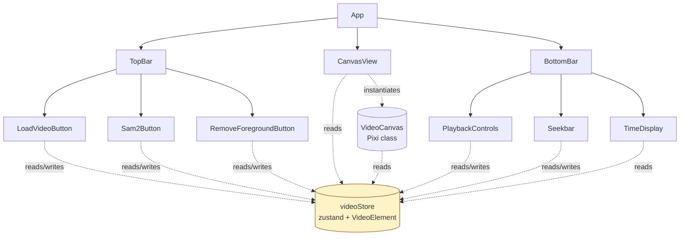

# 05. フロントエンド全体構造

## 5.1 概要

Electron + React + zustand + PixiJS で構築する。`electron-vite` を使い、`main` / `preload` / `renderer` の3プロセス構成を標準のディレクトリで管理する。

UI 描画とビジネスロジック（API 呼び出し・状態管理）と Pixi 描画ロジックは責務分離する。

## 5.2 ディレクトリ構成

[02-architecture.md §2.2](02-architecture.md#22-ディレクトリ構成) の `frontend/` を参照。再掲（要点のみ）:

```
frontend/src/renderer/
├── main.tsx                  # React エントリ（ReactDOM.createRoot）
├── App.tsx                   # トップレベル。3段レイアウトを構成
├── api/
│   └── client.ts             # /health, /session, /segment 呼び出し
├── components/
│   ├── TopBar/
│   │   ├── TopBar.tsx
│   │   ├── LoadVideoButton.tsx
│   │   ├── Sam2Button.tsx
│   │   └── RemoveForegroundButton.tsx
│   ├── Canvas/
│   │   ├── CanvasView.tsx    # React 側ラッパ
│   │   └── VideoCanvas.ts    # Pixi 描画クラス（07-pixi-canvas.md）
│   └── BottomBar/
│       ├── BottomBar.tsx
│       ├── PlaybackControls.tsx
│       ├── Seekbar.tsx
│       └── TimeDisplay.tsx
├── store/
│   └── videoStore.ts         # zustand + VideoElement 同期（08-state-management.md）
└── types/
    └── index.ts              # 共通型（BBox, SessionInfo, etc.）
```

## 5.3 コンポーネント階層



## 5.4 各コンポーネントの責務

### App.tsx

- 3段レイアウトのCSS Grid／Flexboxを構成
- 直接の状態は持たない
- 子コンポーネントを配置するだけ

### TopBar 配下

詳細は [06-ui-layout.md §6.2](06-ui-layout.md#62-トップバー)。

| コンポーネント | 責務 |
|---|---|
| `TopBar.tsx` | レイアウトのみ |
| `LoadVideoButton.tsx` | mp4 ファイル選択 → `videoStore.loadVideo(file)` を呼ぶ |
| `Sam2Button.tsx` | BBox 有効時のみ活性化、押下で `videoStore.runSegment()` を呼ぶ |
| `RemoveForegroundButton.tsx` | `hasSegmentation` のときだけ活性化、押下で `videoStore.runRemoveForeground()` を呼ぶ |

### CanvasView.tsx

- `VideoCanvas`（Pixiクラス）のインスタンスを useRef で保持
- マウント時に Pixi の `Application` を生成し、`VideoCanvas` に渡す
- アンマウント時に Pixi リソースを破棄
- React の状態が必要な場合は zustand を購読し、`VideoCanvas.update*()` メソッドを呼ぶ

詳細は [07-pixi-canvas.md](07-pixi-canvas.md)。

### BottomBar 配下

詳細は [06-ui-layout.md §6.4](06-ui-layout.md#64-ボトムバー)。

| コンポーネント | 責務 |
|---|---|
| `BottomBar.tsx` | レイアウトのみ |
| `PlaybackControls.tsx` | 再生/停止/コマ送り/コマ戻しボタン |
| `Seekbar.tsx` | シークバー（タイムライン）。ドラッグでシーク |
| `TimeDisplay.tsx` | 経過時間 / 総時間 と フレーム番号 / 総フレーム数 |

## 5.5 状態管理の方針

詳細は [08-state-management.md](08-state-management.md)。要点のみ:

- グローバル状態は **すべて `videoStore`（zustand）** に集約する
- `VideoElement`（`<video>` DOM）は `videoStore` 内に保持し、ストアの状態と双方向同期する
- React コンポーネントは `videoStore` のセレクタを購読する
- 各コンポーネントローカルな UI 状態（ホバー、ドラッグ中など）は `useState` で OK

## 5.6 API 呼び出し

すべて `api/client.ts` に集約する。コンポーネントは直接 fetch しない。

```ts
// api/client.ts のおおまかなインターフェース
export async function uploadVideo(file: File): Promise<SessionResponse>;
export async function segment(req: SegmentRequest): Promise<Blob>;
export async function removeForeground(): Promise<Blob>;
```

`videoStore` のアクション内でこれらを呼び、状態を更新する。`/health` はフロントからはポーリングしない（バックエンド側でロード完了を待ち合わせるため）。

## 5.7 環境変数

`frontend/.env` に以下を設定。Vite が `import.meta.env.VITE_*` で参照可能。

| 変数 | 用途 |
|---|---|
| `VITE_API_BASE` | バックエンドのベース URL（既定 `http://localhost:8000`） |

## 5.8 Electron 側の責務

### main プロセス（`src/main/index.ts`）

- BrowserWindow の生成
- ファイル選択ダイアログを `ipcMain.handle('show-open-dialog', ...)` で公開（任意）
  - Web の `<input type="file">` でも mp4 選択は可能なので、必須ではない
  - ネイティブダイアログを使う場合のみ実装

### preload プロセス（`src/preload/index.ts`）

- 上記 IPC を `contextBridge.exposeInMainWorld('api', { ... })` でレンダラーに公開
- 公開 API は最小限

ファイル選択を `<input type="file">` で済ませる場合、preload は空でもよい。

## 5.9 命名・コード規約

- ファイル名: コンポーネントは `PascalCase.tsx`、それ以外は `camelCase.ts`
- 関数コンポーネント: アロー関数ではなく `function` 宣言
- 型: `interface` ではなく `type` を基本とする（プロジェクト統一）
- import パス: `frontend/src/renderer` 内は相対パス。エイリアスは設けない（規模が小さいため）

## 5.10 実装チェックリスト

- [ ] `frontend/` のディレクトリ構成が本仕様と一致
- [ ] `App.tsx` が3段レイアウトを構成し、状態を直接持たない
- [ ] `api/client.ts` が `/session` と `/segment` を型付きで提供
- [ ] コンポーネントは `videoStore` を購読し、直接 fetch しない
- [ ] `VITE_API_BASE` でバックエンドURLが切り替えられる
- [ ] Electron が起動し、レンダラーで React アプリが描画される
