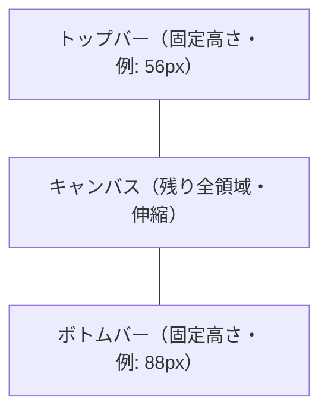

# 06. UI 仕様

## 6.1 全体レイアウト

3段構成（トップバー / キャンバス / ボトムバー）を縦に並べる。CSS Grid または Flexbox いずれでもよい。



```
┌──────────────────────────────────────────────────────┐
│  TopBar  [読み込み] [SAM2] [前景削除]                │  ← 固定高さ
├──────────────────────────────────────────────────────┤
│                                                      │
│                  Canvas (Pixi)                       │  ← 残りの領域
│              （動画 + マスク + BBox）                │
│                                                      │
├──────────────────────────────────────────────────────┤
│  BottomBar                                           │
│  [⏮][⏯][⏭]  ▬▬▬●▬▬▬▬▬▬▬▬▬▬  00:05/00:20  120/600  │  ← 固定高さ
└──────────────────────────────────────────────────────┘
```

実装は `App.tsx` のルート要素を `display: grid; grid-template-rows: auto 1fr auto` で組むのが簡潔。

## 6.2 トップバー

### 6.2.1 構成要素

| 要素 | 説明 |
|---|---|
| `LoadVideoButton` | mp4 を読み込むボタン |
| `Sam2Button` | SAM2 で検出するボタン |
| `RemoveForegroundButton` | 前景を削除するボタン（`Sam2Button` の右隣） |

横並び。左寄せ・右寄せいずれでもよいが、本仕様では **左寄せ** を採用。

### 6.2.2 LoadVideoButton

- 表示: 「動画を読み込む」 or アイコン + テキスト
- 動作: クリックで mp4 ファイル選択ダイアログを開く
  - `<input type="file" accept="video/mp4">` をボタンの裏に隠して使うのが簡潔
  - もしくは Electron のネイティブダイアログ（[05-frontend-structure.md §5.8](05-frontend-structure.md#58-electron-側の責務)）
- 選択結果: `videoStore.loadVideo(file)` を呼ぶ
- 活性条件: 常時活性

### 6.2.3 Sam2Button

- 表示: 「SAM2 で検出」 or アイコン + テキスト
- 活性条件: BBox が有効、かつ SAM2 推論中でない、**かつ前景削除中でない**、かつ動画ロード済み、かつバックエンドの `model_state === "ready"`
- それ以外はグレーアウト（disabled）
- 動作: クリックで `videoStore.runSegment()` を呼ぶ
- 推論中の表示: スピナー or ボタンラベルを「処理中…」に変更（[09-state-transitions.md](09-state-transitions.md) 参照）

詳細な活性条件と状態遷移は [09-state-transitions.md](09-state-transitions.md) を必読。

### 6.2.4 RemoveForegroundButton

- 表示: 「前景を削除」
- 配置: `Sam2Button` の **右隣**
- 活性条件: 動画ロード済み、**再生中**、`hasSegmentation === true`（合成 mp4 が表示されている）、SAM2 推論中でない、前景削除中でない
- 動作: クリックで `videoStore.runRemoveForeground()` を呼ぶ
- 推論中の表示: ボタンラベルを「処理中…」に変更、ボタン disabled
- 失敗時: ボタン横にエラーメッセージ表示。base video と SAM2 結果は維持

詳細は [09-state-transitions.md](09-state-transitions.md) を参照。

## 6.3 キャンバス

詳細は [07-pixi-canvas.md](07-pixi-canvas.md)。本節ではレイアウト観点のみ。

- レンダリング: PixiJS
- アスペクト比: 動画のアスペクトを維持しつつ、利用可能領域に **letterbox** で収める
- 背景: 黒（`#000`）
- マウスインタラクション: BBox のドラッグ操作（停止中のみ）

## 6.4 ボトムバー

### 6.4.1 構成要素

`BottomBar.tsx` は以下の3コンポーネントを横並びに配置する。

| 要素 | 領域 | 内容 |
|---|---|---|
| `PlaybackControls` | 左 | ⏮ コマ戻し / ⏯ 再生・停止 / ⏭ コマ送り |
| `Seekbar` | 中央（伸縮） | タイムライン（シーク可能） |
| `TimeDisplay` | 右 | 経過時間/総時間 と 現在フレーム番号/総フレーム数 |

### 6.4.2 PlaybackControls

| ボタン | 動作 | 活性条件 |
|---|---|---|
| ⏮ コマ戻し | 1 フレーム戻る | 動画ロード済み、停止中、SAM2/前景削除非実行中、フレーム > 0 |
| ⏯ 再生/停止 | トグル | 動画ロード済み、SAM2/前景削除非実行中 |
| ⏭ コマ送り | 1 フレーム進む | 動画ロード済み、停止中、SAM2/前景削除非実行中、フレーム < 総フレーム-1 |

> 動画は終端に到達すると自動的に先頭からループ再生される（`videoElement.loop = true`）。`ended` イベントは発火しない。

- コマ送り/戻しは `videoStore.stepFrame(+1 / -1)` を呼ぶ
- 再生/停止は `videoStore.togglePlay()` を呼ぶ
- アイコン推奨。ラベル併記でも可

### 6.4.3 Seekbar

- 表現: 横長のスライダー（HTML `<input type="range">` でも自前 div でも可）
- 範囲: `0` から `num_frames - 1`
- 値: 現在フレーム番号
- ドラッグ操作: `videoStore.seekTo(frameIdx)` を呼ぶ
- ドラッグ中は再生を一時停止（再生中でも停止状態に強制遷移）。これにより BBox 状態遷移とも整合する（[09-state-transitions.md](09-state-transitions.md)）
- スタイル: 動画ロード前、または SAM2 / 前景削除実行中は disabled

### 6.4.4 TimeDisplay

表記例:
```
00:05.20 / 00:20.04   |   120 / 600
```

- 経過時間: `currentFrame / fps` を `mm:ss.SS` で表示
- 総時間: `num_frames / fps`
- フレーム番号: `currentFrame / num_frames - 1`（または `num_frames`、表記の好みに合わせる）
- 動画ロード前は `--:--.-- / --:--.--   |   - / -` 表示

## 6.5 視覚デザインの最低基準

本仕様で厳密なデザインシステムは定めない。最低限以下を守る。

- ダーク基調（背景 `#1e1e1e` 程度、文字 `#e0e0e0`）
- 操作可能ボタンと disabled は明確に区別（不透明度 0.4 等）
- フォーカスリングを残す（アクセシビリティ）
- キャンバス領域のリサイズに追従する（ResizeObserver）

具体的な配色やフォントは実装時に最小限で決める。本仕様の範囲外。

## 6.6 キーボードショートカット（任意）

MVP では実装しなくてよい。実装するなら以下を推奨。

| キー | 動作 |
|---|---|
| Space | 再生/停止 |
| ← / → | コマ戻し / コマ送り |
| Esc | BBox の選択解除 |

## 6.7 レスポンシブ

ウィンドウサイズ変更でキャンバスがリサイズされる。Pixi の `Application.renderer.resize` を ResizeObserver から呼ぶ（[07-pixi-canvas.md](07-pixi-canvas.md)）。

トップバー／ボトムバーの最小幅未満になった場合の縦積み等の対応は MVP では不要。

## 6.8 実装チェックリスト

- [ ] 3段レイアウトが正しく描画され、ウィンドウリサイズに追従する
- [ ] トップバーに `LoadVideoButton` / `Sam2Button` / `RemoveForegroundButton` が並ぶ
- [ ] `LoadVideoButton` で mp4 を選択でき、`videoStore.loadVideo()` が呼ばれる
- [ ] `Sam2Button` の活性条件が [09-state-transitions.md](09-state-transitions.md) どおり
- [ ] `RemoveForegroundButton` は `hasSegmentation` が真のときのみ活性
- [ ] ボトムバーが3つのサブコンポーネントに分かれている
- [ ] シークバーがドラッグでシークでき、ドラッグ中は再生が止まる
- [ ] フレーム番号と時間が正しく表示される
