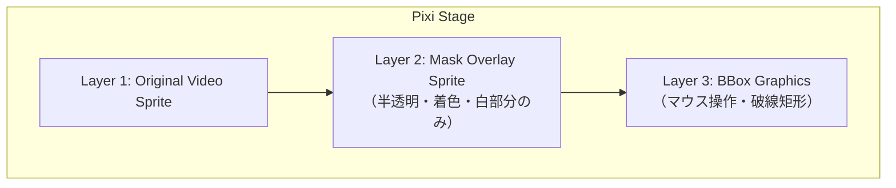

# 07. Pixi キャンバス設計

## 7.1 設計方針

キャンバス描画ロジックは React コンポーネント関数に詰め込まず、**Pixi 専用クラス（`VideoCanvas`）** に閉じ込める。React 側はそのクラスを `useRef` で保持し、ライフサイクル接続のみを行う薄いラッパとする。

理由:
- Pixi の `Application` / `Sprite` / `Graphics` は React のレンダリングサイクルと相性が悪い
- 描画ロジックが React に依存しないため、テストや将来的な差し替えがしやすい
- 状態は zustand に集約され、Pixi クラスは状態を購読 → 描画する一方向の流れになる

## 7.2 ファイル分割

| ファイル | 役割 |
|---|---|
| `frontend/src/renderer/components/Canvas/VideoCanvas.ts` | Pixi 描画クラス本体 |
| `frontend/src/renderer/components/Canvas/CanvasView.tsx` | React ラッパ。`<div ref>` を Pixi にマウント |

## 7.3 描画レイヤ構成

キャンバス上の描画は以下の3レイヤを Pixi の Container で重ねる。



- L1: 原動画。`PIXI.Sprite` の texture を `<video>` 要素から作成（`PIXI.Texture.from(videoElement)`）
- L2: マスク動画。同様に `<video>` から作成。シェーダ or アルファ＋tint で重畳
- L3: BBox 描画。`PIXI.Graphics`（or 矩形 Sprite）でマウス操作と表示

## 7.4 `VideoCanvas` クラス仕様

### 7.4.1 責務

- Pixi `Application` の生成と破棄
- 上記3レイヤの構築・更新・破棄
- ウィンドウ／親要素のリサイズ追従（letterbox 維持）
- マウスイベント（BBox ドラッグ）の処理
- 動画／マスク動画の差し替え対応

`VideoCanvas` は **状態を保持しない**。zustand のセレクタは React 側で購読し、変更時に `VideoCanvas` のメソッドを呼ぶ形にする。例外として、ドラッグ中の一時的なBBox座標など、Pixi 内部のローカルな描画状態だけは持つ（[09-state-transitions.md](09-state-transitions.md) 参照）。

### 7.4.2 公開インターフェース（概略）

```ts
type Bbox = { x1: number; y1: number; x2: number; y2: number };  // 動画ピクセル座標

type VideoCanvasOptions = {
  container: HTMLElement;        // Pixi Application を mount する div
  onBboxChange: (bbox: Bbox | null) => void;  // ユーザー操作で BBox が変わったとき
};

class VideoCanvas {
  constructor(options: VideoCanvasOptions);

  // 動画関連
  setOriginalVideo(video: HTMLVideoElement | null): void;
  setMaskVideo(video: HTMLVideoElement | null): void;     // マスク差し替え。null で消去

  // BBox 関連
  setBboxInteractive(enabled: boolean): void;             // 動画停止中のみ true
  setBboxDisplay(bbox: Bbox | null): void;                // 外部からの表示同期
  clearBbox(): void;                                       // 表示も内部状態もクリア

  // 重畳表示の見た目
  setOverlayColor(rgb: [number, number, number]): void;   // 例: [255, 64, 64]
  setOverlayAlpha(alpha01: number): void;                 // 0〜1

  // ライフサイクル
  resize(): void;                                          // 親要素のサイズに合わせて再計算
  destroy(): void;
}
```

### 7.4.3 座標系

Pixi 上のステージ座標と動画ピクセル座標は letterbox で異なる。`VideoCanvas` 内に変換ヘルパを持つ。

```ts
private stageToVideo(stagePoint: { x: number; y: number }): { x: number; y: number };
private videoToStage(videoPoint: { x: number; y: number }): { x: number; y: number };
```

- ユーザーがマウスで指定した座標は `stageToVideo` で動画ピクセル座標に変換 → `onBboxChange` で外に出す
- zustand に保存される BBox は **常に動画ピクセル座標**（[04-api.md §4.6](04-api.md#46-bbox-座標系の規約)）

### 7.4.4 マスク重畳の実装

要件（[01.2 F5](01-overview.md#12-機能要件)）:
- オリジナル動画をコピーして、半透過 + 色をつけて、マスクが白の箇所のみを重畳

実装方針:

Pixi の `VideoSource` (`Texture.from(videoElement)`) は VideoSource 生成時にデフォルトで `autoPlay: true` となっており、`video.play()` を自動呼び出しする。マスク動画を Pixi に直接渡すと再生制御が乗っ取られて原動画とのズレが生じるため、**Canvas を中継する方式**を採用する。

#### Canvas 中継方式（採用実装）

```ts
// 原動画: Pixi VideoSource に直接渡す（autoPlay: false で自動再生を抑制）
const tex = PIXI.Texture.from(originalVideo, { autoPlay: false });
this.originalSprite = new PIXI.Sprite(tex);

// マスク: Canvas を中継して Pixi に渡す
const canvas = document.createElement("canvas");
canvas.width = videoWidth;
canvas.height = videoHeight;
const tex = PIXI.Texture.from(canvas);
this.maskSprite = new PIXI.Sprite(tex);
this.maskSprite.tint      = 0xff4040;   // 着色
this.maskSprite.alpha     = 0.5;        // 半透過
this.maskSprite.blendMode = "add";      // 黒(非マスク)=加算ゼロ、白(マスク)=tint 色を加算
```

`blendMode = "add"` の効果:
- マスクが黒（非マスク領域）→ 原動画に 0 を加算 → 変化なし ✓
- マスクが白（マスク領域）→ 着色した tint 色を加算 → カラーハイライト ✓

Canvas テクスチャは Pixi ticker から毎フレーム更新する（§7.4.5 参照）。

### 7.4.5 同期（原動画 ⇔ マスク動画）

- マスク動画は原動画と同じ fps・同じフレーム数で生成される（[03-backend.md §3.6.2](03-backend.md#362-マスク--mp4-エンコード)）
- 再生/シーク/停止の制御は `videoStore` のアクション側で一元管理（[08-state-management.md §8.5.4](08-state-management.md#854-マスク動画の同期)）
- `VideoCanvas` 内では **Pixi ticker から毎フレーム Canvas にフレームを描画**して同期する:

```ts
// Pixi ticker に登録（setMaskVideo 時）
private updateMaskCanvas = (): void => {
  if (maskVideo.readyState < 2) return;
  if (maskVideo.currentTime === this.lastMaskTime) return;  // 変化なければスキップ
  this.lastMaskTime = maskVideo.currentTime;
  this.maskCtx.drawImage(maskVideo, 0, 0, w, h);
  this.maskCanvasTexture.source.update();  // GPU テクスチャを更新
};
app.ticker.add(this.updateMaskCanvas);
```

ticker 駆動にする理由: 原動画の Pixi テクスチャ更新と同一 rAF サイクル内でマスク Canvas も更新することで、両者の描画ズレを最小化する。再生中のフレーム単位の誤差（±1 コマ）はブラウザの 2 要素間同期制約上、避けられない。コマ送り・シーク時は `currentTime` を明示設定するため完全一致する。

### 7.4.6 BBox の描画とインタラクション

- 描画: `PIXI.Graphics` で破線または半透明塗りの矩形 + 境界線
- インタラクション:
  - 停止中 (`setBboxInteractive(true)`): pointerdown → pointermove → pointerup でドラッグ作成
  - 再生中・SAM2推論中など (`false`): イベント無視、表示も消す
- 完成時に `onBboxChange(bbox)` を発火
- ドラッグ中の一時的な座標は `VideoCanvas` 内のローカル変数で持つ（zustand には commit されない）。確定後に zustand へ反映

### 7.4.7 リサイズ

- 親 `<div>` を ResizeObserver で監視
- 変更時に `app.renderer.resize(width, height)` と各 Sprite のスケール／位置を再計算（letterbox）
- アスペクトは `(videoWidth / videoHeight)` を維持

## 7.5 React ラッパ（`CanvasView.tsx`）

### 5.5.1 責務

- マウント時に `VideoCanvas` を生成し、コンテナ要素を渡す
- アンマウント時に `videoCanvas.destroy()` を呼ぶ
- zustand のセレクタを購読し、`VideoCanvas` のメソッドを呼ぶ
- ユーザー操作（BBox 確定）は `onBboxChange` コールバックで受け取り、zustand のアクションを呼ぶ

### 7.5.2 擬似コード

```tsx
function CanvasView() {
  const containerRef = useRef<HTMLDivElement>(null);
  const canvasRef = useRef<VideoCanvas | null>(null);

  const setBbox          = useVideoStore(s => s.setBbox);
  const videoElement     = useVideoStore(s => s.videoElement);
  const maskVideoElement = useVideoStore(s => s.maskVideoElement);
  const maskVideoSrc     = useVideoStore(s => s.maskVideoSrc);  // src 変化を追跡
  const isPlaying        = useVideoStore(s => s.isPlaying);
  const segmentState     = useVideoStore(s => s.segmentState);
  const bbox             = useVideoStore(s => s.bbox);
  const videoMeta        = useVideoStore(s => s.videoMeta);

  // mount / unmount
  useEffect(() => {
    if (!containerRef.current) return;
    canvasRef.current = new VideoCanvas({ container: containerRef.current, onBboxChange: setBbox });
    return () => { canvasRef.current?.destroy(); canvasRef.current = null; };
  }, [setBbox]);

  // 原動画差し替え
  useEffect(() => {
    canvasRef.current?.setOriginalVideo(videoElement);
  }, [videoElement, videoMeta?.width, videoMeta?.height]);

  // マスク動画差し替え（maskVideoSrc が変化するたびに発火）
  // maskVideoElement は常に同一参照なので effect の依存にならない点に注意
  useEffect(() => {
    canvasRef.current?.setMaskVideo(maskVideoSrc && maskVideoElement ? maskVideoElement : null);
  }, [maskVideoSrc, maskVideoElement]);

  // BBox 操作可否（推論中・再生中・動画未ロード時は無効）
  useEffect(() => {
    const interactive = !isPlaying && segmentState !== "running" && videoMeta != null;
    canvasRef.current?.setBboxInteractive(interactive);
  }, [isPlaying, segmentState, videoMeta]);

  // 外部からの BBox 表示同期
  useEffect(() => { canvasRef.current?.setBboxDisplay(bbox); }, [bbox]);

  return <div ref={containerRef} className="canvas-host" />;
}
```

### 7.5.3 注意点

- `VideoCanvas` のメソッドはアイドル時に呼ばれる前提でよい。レンダリングは Pixi の ticker が自動で回す
- React の strict mode による double mount に対応するため、`destroy()` で完全なクリーンアップを保証

## 7.6 パフォーマンス上の留意

- マスク Canvas の `drawImage` は `maskVideo.currentTime` が前フレームから変化していない場合にスキップする（停止中の CPU 節約）
- マスク mp4 が差し替わった際は、古い ObjectURL を `URL.revokeObjectURL` で必ず開放（ストア側の責務）
- マスクなし時（`maskVideoSrc === null`）は ticker が走っても早期 return するため描画コストはほぼゼロ
- 原動画 Sprite は Pixi VideoSource が ticker/VFC でテクスチャ更新を管理する。マスク Canvas は独自 ticker コールバックで更新する

## 7.7 実装チェックリスト

- [ ] `VideoCanvas` クラスが Pixi `Application` を生成・破棄できる
- [ ] 原動画（Pixi VideoSource）とマスク（Canvas Sprite）が3レイヤ構成で描画される
- [ ] マスクの白部分が `blendMode: "add"` により着色ハイライトとして重畳される
- [ ] Pixi ticker から `updateMaskCanvas` が呼ばれ Canvas が毎フレーム更新される
- [ ] コマ送り・シーク時はマスクが正確に同期する（再生中は ±1 コマの誤差あり）
- [ ] BBox がマウスドラッグで作成でき、`onBboxChange` で外に出る
- [ ] 推論中・再生中は BBox 操作が無効になる
- [ ] 親要素のリサイズに letterbox で追従する
- [ ] アンマウント時に ticker が停止し、すべてのリソースが解放される
