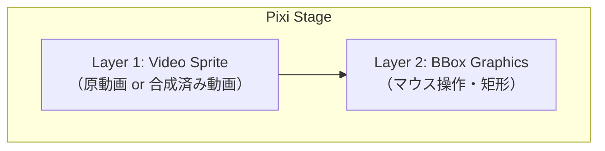

# 07. Pixi キャンバス設計

## 7.1 設計方針

キャンバス描画ロジックは React コンポーネント関数に詰め込まず、**Pixi 専用クラス（`VideoCanvas`）** に閉じ込める。React 側はそのクラスを `useRef` で保持し、ライフサイクル接続のみを行う薄いラッパとする。

理由:
- Pixi の `Application` / `Sprite` / `Graphics` は React のレンダリングサイクルと相性が悪い
- 描画ロジックが React に依存しないため、テストや将来的な差し替えがしやすい
- 状態は zustand に集約され、Pixi クラスは状態を購読 → 描画する一方向の流れになる

## 7.2 ファイル分割

| ファイル | 役割 |
|---|---|
| `frontend/src/renderer/components/Canvas/VideoCanvas.ts` | Pixi 描画クラス本体 |
| `frontend/src/renderer/components/Canvas/CanvasView.tsx` | React ラッパ。`<div ref>` を Pixi にマウント |

## 7.3 描画レイヤ構成

キャンバス上の描画は以下の2レイヤを Pixi の Container で重ねる。マスクの重畳合成は **バックエンドが mp4 として返す**ため、フロント側は単一の動画スプライトを表示するだけでよい（[03-backend.md §3.6.2](03-backend.md#362-原動画マスクの合成-mp4-エンコード)）。



- L1: `videoElement` を `PIXI.VideoSource` 経由で `PIXI.Sprite` に貼る。`autoPlay: false` で Pixi 側の自動再生を抑制（再生制御は zustand 側に統一）
- L2: `PIXI.Graphics` でマウス操作と表示

`videoElement.src` は zustand 側で動画ロード時に原動画 ObjectURL、SAM2 実行後に合成済み mp4 ObjectURL に差し替わる（[08-state-management.md §8.5](08-state-management.md#85-videoelement-との同期)）。`VideoCanvas` 自体はその違いを意識しない。

## 7.4 `VideoCanvas` クラス仕様

### 7.4.1 責務

- Pixi `Application` の生成と破棄
- 上記2レイヤの構築・更新・破棄
- ウィンドウ／親要素のリサイズ追従（letterbox 維持）
- マウスイベント（BBox ドラッグ）の処理
- 動画要素の差し替え対応

`VideoCanvas` は **状態を保持しない**。zustand のセレクタは React 側で購読し、変更時に `VideoCanvas` のメソッドを呼ぶ形にする。例外として、ドラッグ中の一時的なBBox座標など、Pixi 内部のローカルな描画状態だけは持つ（[09-state-transitions.md](09-state-transitions.md) 参照）。

### 7.4.2 公開インターフェース（概略）

```ts
type Bbox = { x1: number; y1: number; x2: number; y2: number };  // 動画ピクセル座標

type VideoCanvasOptions = {
  container: HTMLElement;        // Pixi Application を mount する div
  onBboxChange: (bbox: Bbox | null) => void;  // ユーザー操作で BBox が変わったとき
};

class VideoCanvas {
  constructor(options: VideoCanvasOptions);

  // 動画
  setVideo(video: HTMLVideoElement | null): void;          // null で消去

  // BBox
  setBboxInteractive(enabled: boolean): void;             // 動画停止中のみ true
  setBboxDisplay(bbox: Bbox | null): void;                // 外部からの表示同期
  clearBbox(): void;                                       // 表示も内部状態もクリア

  // ライフサイクル
  resize(): void;                                          // 親要素のサイズに合わせて再計算
  destroy(): void;
}
```

### 7.4.3 座標系

Pixi 上のステージ座標と動画ピクセル座標は letterbox で異なる。`VideoCanvas` 内に変換ヘルパを持つ。

```ts
private stageToVideo(stagePoint: { x: number; y: number }): { x: number; y: number };
```

- ユーザーがマウスで指定した座標は `stageToVideo` で動画ピクセル座標に変換 → `onBboxChange` で外に出す
- zustand に保存される BBox は **常に動画ピクセル座標**（[04-api.md §4.6](04-api.md#46-bbox-座標系の規約)）

### 7.4.4 動画スプライトの実装

```ts
// VideoSource を明示的に構築して autoPlay: false を効かせる。
const source = new PIXI.VideoSource({ resource: video, autoPlay: false });
const tex    = new PIXI.Texture({ source });
this.videoSprite = new PIXI.Sprite(tex);
```

`autoPlay: false` を指定する理由: Pixi の `VideoSource` は既定で `video.play()` を自動呼び出しするため、zustand 側の再生制御と競合する。再生・停止・シークは zustand のアクションに一元化し、Pixi 側は受動的にテクスチャ更新だけ受け取る。

テクスチャの更新は Pixi の VideoSource が内部で `requestVideoFrameCallback` または ticker から自動的に行うため、`VideoCanvas` 側で明示的なフレーム同期コードは不要。

### 7.4.5 BBox の描画とインタラクション

- 描画: `PIXI.Graphics` で半透明塗り（`fill alpha 0.1`） + 境界線（`stroke width 2`）の矩形
- インタラクション:
  - 停止中 (`setBboxInteractive(true)`): pointerdown → pointermove → pointerup でドラッグ作成
  - 再生中・SAM2推論中など (`false`): イベント無視、表示も消す
- 完成時に `onBboxChange(bbox)` を発火
- ドラッグ中の一時的な座標は `VideoCanvas` 内のローカル変数で持つ（zustand には commit されない）。確定後に zustand へ反映
- 5px 未満の極端に小さい矩形はフロント側で破棄して `onBboxChange(null)` を発火する

### 7.4.6 リサイズ

- 親 `<div>` を ResizeObserver で監視
- 変更時に `app.renderer.resize(width, height)` と各 Container のスケール／位置を再計算（letterbox）
- アスペクトは `(videoWidth / videoHeight)` を維持

## 7.5 React ラッパ（`CanvasView.tsx`）

### 7.5.1 責務

- マウント時に `VideoCanvas` を生成し、コンテナ要素を渡す
- アンマウント時に `videoCanvas.destroy()` を呼ぶ
- zustand のセレクタを購読し、`VideoCanvas` のメソッドを呼ぶ
- ユーザー操作（BBox 確定）は `onBboxChange` コールバックで受け取り、zustand のアクションを呼ぶ

### 7.5.2 擬似コード

```tsx
function CanvasView() {
  const containerRef = useRef<HTMLDivElement>(null);
  const canvasRef = useRef<VideoCanvas | null>(null);

  const setBbox       = useVideoStore(s => s.setBbox);
  const videoElement  = useVideoStore(s => s.videoElement);
  const isPlaying     = useVideoStore(s => s.isPlaying);
  const segmentState  = useVideoStore(s => s.segmentState);
  const bbox          = useVideoStore(s => s.bbox);
  const videoMeta     = useVideoStore(s => s.videoMeta);

  // mount / unmount
  useEffect(() => {
    if (!containerRef.current) return;
    const canvas = new VideoCanvas({ container: containerRef.current, onBboxChange: setBbox });
    canvasRef.current = canvas;
    return () => { canvas.destroy(); canvasRef.current = null; };
  }, [setBbox]);

  // 動画差し替え（loadVideo / runSegment 後の合成動画ともに同じ要素経由）
  useEffect(() => {
    canvasRef.current?.setVideo(videoElement);
  }, [videoElement, videoMeta?.width, videoMeta?.height]);

  // BBox 操作可否（推論中・再生中・動画未ロード時は無効）
  useEffect(() => {
    const interactive = !isPlaying && segmentState !== "running" && videoMeta != null;
    canvasRef.current?.setBboxInteractive(interactive);
  }, [isPlaying, segmentState, videoMeta]);

  // 外部からの BBox 表示同期
  useEffect(() => { canvasRef.current?.setBboxDisplay(bbox); }, [bbox]);

  return <div ref={containerRef} className="canvas-host" />;
}
```

### 7.5.3 注意点

- `VideoCanvas` のメソッドはアイドル時に呼ばれる前提でよい。レンダリングは Pixi の ticker が自動で回す
- React の strict mode による double mount に対応するため、`destroy()` で完全なクリーンアップを保証
- `videoElement` 自体の参照は zustand 内で固定（同じ要素を `src` だけ差し替えて使い回す）。サイズ変更を effect 依存に取り込むため `videoMeta?.width/height` を併記する

## 7.6 パフォーマンス上の留意

- 動画スプライトは Pixi VideoSource が内部で texture 更新を管理するため、独自 ticker は不要
- `videoElement.src` 差し替え時は呼び出し側（zustand）で旧 ObjectURL を `URL.revokeObjectURL` で必ず開放
- BBox 用の `Graphics` は変化のあったときだけ `clear()` → 再描画

## 7.7 実装チェックリスト

- [ ] `VideoCanvas` クラスが Pixi `Application` を生成・破棄できる
- [ ] 動画スプライト（`PIXI.VideoSource(autoPlay:false)` 由来）と BBox Graphics の 2 レイヤ構成で描画される
- [ ] `setVideo(video)` で `videoElement` の差し替えに対応する
- [ ] BBox がマウスドラッグで作成でき、`onBboxChange` で外に出る
- [ ] 5px 未満の矩形は破棄される
- [ ] 推論中・再生中は BBox 操作が無効になる
- [ ] 親要素のリサイズに letterbox で追従する
- [ ] アンマウント時にすべてのリソースが解放される
