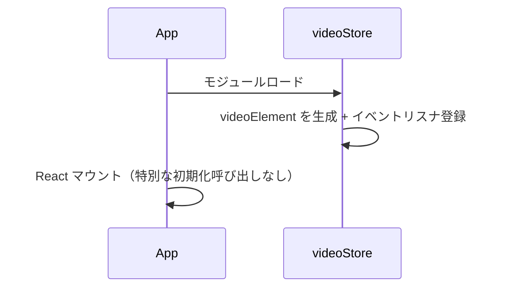

# 08. 状態管理

## 8.1 方針

- グローバル状態は **zustand 1ストア（`videoStore`）** に集約する
- `<video>` DOM 要素（`VideoElement`）は zustand ストア内に保持する。**ストアの状態と VideoElement は同一ファイル内で双方向同期する**
- React コンポーネントはセレクタ単位でストアを購読する
- `VideoCanvas`（Pixi クラス）はストアを直接購読しない。React 側が購読 → メソッド呼び出しで通知

## 8.2 ファイル

- `frontend/src/renderer/store/videoStore.ts`：状態定義・アクション・VideoElement 同期処理を **すべて含む**

このファイルに以下が共存する:

1. zustand ストアの create
2. 内部で生成・管理する `<video>` 要素 1 つ（モジュールスコープ変数）
3. 状態 ⇔ VideoElement の同期ロジック（イベントリスナの登録）
4. API 呼び出しを発火するアクション
5. 現在の `videoElement.src` を保持する ObjectURL のモジュールスコープ変数（差し替え時に revoke するため）

## 8.3 状態の構造

```ts
type SegmentState = "idle" | "running" | "error";
type RemoveState  = "idle" | "running" | "error";

type Bbox = { x1: number; y1: number; x2: number; y2: number };  // 動画ピクセル座標

type VideoMeta = {
  width: number;
  height: number;
  fps: number;
  numFrames: number;
  durationSec: number;
};

type VideoStoreState = {
  // 動画メタ情報（バックエンドからの返却 + フロントの実 video から）
  // videoMeta !== null が「バックエンドにセッションが存在する」フラグも兼ねる。
  // バックエンドは常に最大1件のセッションだけを保持し、session_id は持たない。
  // /remove 完了で base video が差し替わるため、width/height/fps/numFrames は
  // /remove のレスポンス（実 video の loadedmetadata）に応じて更新される。
  videoMeta: VideoMeta | null;

  // VideoElement（同じ要素参照を使い回す。src だけ差し替える）
  // loadVideo 直後 / /remove 完了後 → base video ObjectURL
  // SAM2 実行後                     → サーバが返した合成済み mp4 の ObjectURL
  videoElement: HTMLVideoElement | null;

  // 再生状態
  isPlaying: boolean;
  currentFrame: number;     // 0始まり

  // BBox
  bbox: Bbox | null;        // null=未指定

  // SAM2 推論状態
  segmentState: SegmentState;
  segmentError: string | null;

  // 直近の SAM2 抽出が完了済みか（= /segment レスポンスを受けて合成 mp4 を表示中か）。
  // /segment 完了で true、/remove 完了 / loadVideo で false。
  // RemoveForegroundButton の活性条件として使う。
  hasSegmentation: boolean;

  // 前景削除の進行状態
  removeState: RemoveState;
  removeError: string | null;
};
```

`/health` のポーリングおよび `modelState` の保持はフロントでは行わない（`/session` 呼び出し時にバックエンド側で `wait_ready(5.0)` がブロックするため。[03-backend.md §3.4.4](03-backend.md#344-リクエスト処理時のロード待ち合わせ)）。

## 8.4 アクション

```ts
type VideoStoreActions = {
  // 動画ロード
  loadVideo: (file: File) => Promise<void>;

  // 再生制御
  togglePlay: () => void;
  play: () => void;
  pause: () => void;
  stepFrame: (delta: number) => void;     // ±1（コマ送り/戻し）
  seekTo: (frameIdx: number) => void;

  // BBox
  setBbox: (bbox: Bbox | null) => void;
  clearBbox: () => void;

  // SAM2
  runSegment: () => Promise<void>;

  // 前景削除
  runRemoveForeground: () => Promise<void>;

  // クリーンアップ
  reset: () => void;                      // 動画切替や close 時
};
```

## 8.5 VideoElement との同期

### 8.5.1 video 要素の生成

`videoStore.ts` のモジュールスコープで 1 つだけ生成する。DOM ツリーには加えず、メモリ上で保持。Pixi の `VideoSource` がこの要素から直接テクスチャを生成する（[07-pixi-canvas.md §7.4.4](07-pixi-canvas.md#744-動画スプライトの実装)）。

```ts
function createVideoElement(): HTMLVideoElement {
  const v = document.createElement("video");
  v.crossOrigin = "anonymous";
  v.muted = true;        // 自動再生制限の回避
  v.playsInline = true;
  v.preload = "auto";
  return v;
}
const videoElement = createVideoElement();
let videoObjectUrl: string | null = null;
```

### 8.5.2 ストア → VideoElement（コマンド）

各アクションでストアの状態を更新したあと、必要に応じて video のメソッドを呼ぶ。

| アクション | VideoElement 操作 |
|---|---|
| `loadVideo(file)` | 旧 `videoObjectUrl` を revoke → `URL.createObjectURL(file)` を `videoElement.src` に → `load()` |
| `play()` | `videoElement.play()` |
| `pause()` | `videoElement.pause()` |
| `seekTo(idx)` | `pause()` 後に `videoElement.currentTime = idx / fps` |
| `stepFrame(±1)` | `pause()` 後に `seekTo(currentFrame ± 1)` |
| `runSegment` 完了時 | `currentTime` と `paused` を保存 → 旧 `videoObjectUrl` を revoke → 合成 mp4 Blob を ObjectURL 化して `videoElement.src` に差し替え → `load()` → `canplay` 待機 → `currentTime` と再生状態を復元 |
| `runRemoveForeground` 完了時 | `currentTime` と `paused` を保存 → 旧 `videoObjectUrl` を revoke → 新 base video Blob を ObjectURL 化して `videoElement.src` に差し替え → `load()` → `canplay` 待機 → `currentTime` と再生状態を復元 |
| `reset()` | `pause()` + `removeAttribute("src")` + `load()` + `videoObjectUrl` を revoke |

### 8.5.3 VideoElement → ストア（イベント）

video 要素のイベントを購読してストアに反映する。リスナの登録は `videoStore.ts` 内のモジュール初期化時に一度だけ行う（要素は使い回すので再登録は不要）。

| イベント | 反映 |
|---|---|
| `loadedmetadata` | `videoMeta.width/height` を実値で確定 |
| `play` | `isPlaying = true`、`bbox = null` |
| `pause` | `isPlaying = false` |
| `ended` | `isPlaying = false` |
| `timeupdate` | `currentFrame = Math.round(currentTime * fps)`（`videoMeta` 未確定のときはスキップ） |
| `requestVideoFrameCallback`（利用可能時） | 同上、より高頻度で更新 |

`requestVideoFrameCallback` が利用可能なら、`timeupdate` より精度が高いので併用する。

## 8.6 状態変更がトリガする副作用

| 変更 | 副作用 |
|---|---|
| `play()` | `bbox = null`（再生中に BBox が無効化されるため） |
| `stepFrame()` / `seekTo()` | `bbox = null`（フレーム位置が変わるため）|
| `runSegment` 開始 | `segmentState = "running"`、`bbox = null` |
| `runSegment` 完了 | サーバから返った合成 mp4 を `videoElement.src` に差し替え、再生位置を復元、`segmentState = "idle"`、`hasSegmentation = true` |
| `runSegment` 失敗 | `segmentState = "error"`、`segmentError = message` |
| `runRemoveForeground` 開始 | `removeState = "running"`、`bbox = null` |
| `runRemoveForeground` 完了 | サーバから返った新 base video を `videoElement.src` に差し替え、再生位置を復元、`removeState = "idle"`、`hasSegmentation = false` |
| `runRemoveForeground` 失敗 | `removeState = "error"`、`removeError = message`。`videoElement.src` と `hasSegmentation` は変更しない（再試行可能なように） |
| `loadVideo` | 既存 `videoMeta` / `bbox` / `segmentState` / `hasSegmentation` / `removeState` を全クリア。`videoElement.src` を新規 ObjectURL に差し替え、バックエンドへも multipart アップロード |

具体的な遷移は [09-state-transitions.md](09-state-transitions.md) で定義。

## 8.7 セレクタの推奨パターン

不要な再レンダリングを避けるため、購読は最小限のフィールドに絞る:

```ts
const isPlaying = useVideoStore(s => s.isPlaying);
const bbox = useVideoStore(s => s.bbox);
```

複数フィールドを取るときは shallow 比較を使う:

```ts
import { shallow } from "zustand/shallow";
const { currentFrame, numFrames, fps } = useVideoStore(
  s => ({ currentFrame: s.currentFrame, numFrames: s.videoMeta?.numFrames ?? 0, fps: s.videoMeta?.fps ?? 0 }),
  shallow
);
```

## 8.8 起動時のフロー



`/health` ポーリングはフロントでは持たない。モデルがまだロード中なら `/session` 呼び出しでバックエンドが最大 5 秒待機し、超過時のみ 503 を返す（[04-api.md §4.7](04-api.md#47-タイムアウト方針)）。

## 8.9 終了処理

`videoStore.reset()` または React のアンマウントで:

- `videoElement.pause()` と `removeAttribute("src")` + `load()`
- `videoObjectUrl` を `URL.revokeObjectURL`
- `requestVideoFrameCallback` を発行している場合は `cancelVideoFrameCallback`
- バックエンドのセッションはフロントから明示削除しない。サーバーは新規 `/session` 呼び出しで自動的に旧セッションを破棄する（[03-backend.md §3.5.2](03-backend.md#352-ライフタイム)）

## 8.10 実装チェックリスト

- [ ] `videoStore.ts` 1 ファイル内に状態・アクション・VideoElement 同期がすべて存在
- [ ] `<video>` 要素はストアのモジュールスコープで 1 つだけ生成・破棄される
- [ ] `loadedmetadata`, `play`, `pause`, `timeupdate` がストア状態に反映される
- [ ] `runSegment` 完了時に合成 mp4 で `videoElement.src` を差し替え、再生位置と再生状態が復元される
- [ ] `runSegment` 完了時に `hasSegmentation = true` がセットされる
- [ ] `runRemoveForeground` 完了時に新 base video で `videoElement.src` を差し替え、`hasSegmentation = false` に戻される
- [ ] `runRemoveForeground` 失敗時は表示中の動画を変更しない
- [ ] `videoElement.src` 差し替え時に古い ObjectURL が revoke される
- [ ] 再生開始 / シーク時に BBox がクリアされる
- [ ] React コンポーネントはセレクタで購読し、不要な再レンダリングが起きない
