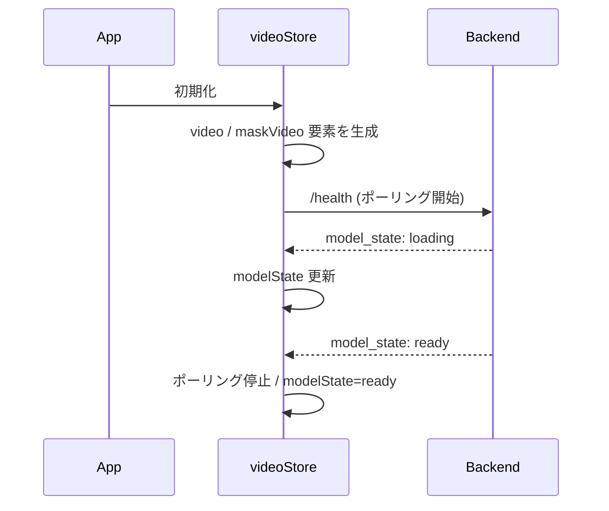

# 08. 状態管理

## 8.1 方針

- グローバル状態は **zustand 1ストア（`videoStore`）** に集約する
- `<video>` DOM 要素（`VideoElement`）は zustand ストア内に保持する。**ストアの状態と VideoElement は同一ファイル内で双方向同期する**
- React コンポーネントはセレクタ単位でストアを購読する
- `VideoCanvas`（Pixi クラス）はストアを直接購読しない。React 側が購読 → メソッド呼び出しで通知

## 8.2 ファイル

- `frontend/src/renderer/store/videoStore.ts`：状態定義・アクション・VideoElement 同期処理を **すべて含む**

このファイルに以下が共存する:

1. zustand ストアの create
2. 内部で生成・管理する `<video>` 要素（原動画用、マスク動画用）
3. 状態 ⇔ VideoElement の同期ロジック（イベントリスナの登録・解除）
4. API 呼び出しを発火するアクション

## 8.3 状態の構造

```ts
type ModelState = "unknown" | "loading" | "ready" | "failed";
type SegmentState = "idle" | "running" | "error";

type Bbox = { x1: number; y1: number; x2: number; y2: number };  // 動画ピクセル座標

type VideoMeta = {
  width: number;
  height: number;
  fps: number;
  numFrames: number;
  durationSec: number;
};

type VideoStoreState = {
  // バックエンド
  modelState: ModelState;

  // 動画メタ情報（バックエンドからの返却 + フロントの実 video から）
  // videoMeta !== null が「バックエンドにセッションが存在する」フラグも兼ねる。
  // バックエンドは常に最大1件のセッションだけを保持し、session_id は持たない。
  videoMeta: VideoMeta | null;

  // VideoElement（直接の参照は store 内のみ。React からは getter 経由）
  videoElement: HTMLVideoElement | null;       // 原動画
  maskVideoElement: HTMLVideoElement | null;   // マスク動画（常に同じ要素参照、src だけ差し替える）

  // マスク動画の現在の src（blob URL または null）
  // maskVideoElement は参照が変わらないため、React effect の依存として使えない。
  // src 変化を追跡する専用フィールドとして保持する。
  maskVideoSrc: string | null;

  // 再生状態
  isPlaying: boolean;
  currentFrame: number;     // 0始まり

  // BBox
  bbox: Bbox | null;        // null=未指定

  // SAM2 推論状態
  segmentState: SegmentState;
  segmentError: string | null;
};
```

## 8.4 アクション

```ts
type VideoStoreActions = {
  // 起動時（App マウント時に呼ぶ）
  startHealthPolling: () => void;         // /health を一定間隔でポーリング開始
  stopHealthPolling: () => void;          // ポーリング停止

  // 動画ロード
  loadVideo: (file: File) => Promise<void>;

  // 再生制御
  togglePlay: () => void;
  play: () => void;
  pause: () => void;
  stepFrame: (delta: number) => void;     // ±1（コマ送り/戻し）
  seekTo: (frameIdx: number) => void;

  // BBox
  setBbox: (bbox: Bbox | null) => void;
  clearBbox: () => void;

  // SAM2
  runSegment: () => Promise<void>;

  // クリーンアップ
  reset: () => void;                      // 動画切替や close 時
};
```

## 8.5 VideoElement との同期

### 8.5.1 video 要素の生成

`videoStore.ts` 内で2つの `<video>` を生成する。DOM ツリーには加えず、メモリ上で保持。`VideoCanvas` がこれらの要素から Canvas にフレームを描画する（Pixi の VideoSource には渡さない。詳細は [07-pixi-canvas.md §7.4.4](07-pixi-canvas.md#744-マスク重畳の実装)）。

```ts
function createVideoElement(): HTMLVideoElement {
  const v = document.createElement("video");
  v.crossOrigin = "anonymous";
  v.muted = true;        // 自動再生制限の回避
  v.playsInline = true;
  v.preload = "auto";
  return v;
}
```

### 8.5.2 ストア → VideoElement（コマンド）

各アクションでストアの状態を更新したあと、必要に応じて video のメソッドを呼ぶ。

| アクション | VideoElement 操作 |
|---|---|
| `loadVideo(file)` | `videoElement.src = URL.createObjectURL(file)` |
| `play()` | `videoElement.play()` + `maskVideoElement?.play()` |
| `pause()` | `videoElement.pause()` + `maskVideoElement?.pause()` |
| `seekTo(idx)` | `videoElement.currentTime = idx / fps` + マスクも同期 |
| `stepFrame(±1)` | `pause()` 後に `seekTo(currentFrame ± 1)` |
| `runSegment` 完了時 | `maskVideoElement.src = URL.createObjectURL(blob)` → `maskVideoSrc` を新 URL に更新 |
| `loadVideo(file)` 追加分 | `maskVideoSrc: null` に更新（Pixi にマスク削除を通知） |

### 8.5.3 VideoElement → ストア（イベント）

video 要素のイベントを購読してストアに反映する。リスナの登録・解除は `videoStore.ts` 内で完結させる。

| イベント | 反映 |
|---|---|
| `loadedmetadata` | `videoMeta.width/height` を実値で確定 |
| `play` | `isPlaying = true` |
| `pause` | `isPlaying = false` |
| `timeupdate` または `requestVideoFrameCallback` | `currentFrame = Math.round(currentTime * fps)` |
| `ended` | `isPlaying = false` |

`requestVideoFrameCallback` が利用可能なら、`timeupdate` より精度が高いので優先する。

### 8.5.4 マスク動画の同期

マスク動画は原動画のアクション発火時に同期する。**再生中は `currentTime` を書き換えない**。

再生中に `maskVideoElement.currentTime` を変更するとシーク命令が発行されてデコードパイプラインが中断し、フレームがずれる原因になる。そのため同期はアクション単位で行う:

| アクション | マスク同期 |
|---|---|
| `play()` | 再生前に `mask.currentTime = video.currentTime` を設定してから両方 play |
| `pause()` | 両方 pause |
| `stepFrame(±1)` / `seekTo()` | 両方を同時に `currentTime = t` に設定（直列でなく並列） |
| `loadVideo` | mask.src をクリア、`maskVideoSrc: null` |
| `runSegment` 完了 | `canplay` 待機後に `mask.currentTime = video.currentTime` → `maskVideoSrc` 更新 |

- マスク動画差し替え時は古い ObjectURL を `URL.revokeObjectURL` で必ず開放
- フレーム単位の描画同期は `VideoCanvas` 側の Pixi ticker が担う（[07-pixi-canvas.md §7.4.5](07-pixi-canvas.md#745-同期原動画--マスク動画)）

## 8.6 状態変更がトリガする副作用

| 変更 | 副作用 |
|---|---|
| `isPlaying: false → true` | BBox を強制的に `null` にする（[09-state-transitions.md](09-state-transitions.md)） |
| `currentFrame` が変わる（`stepFrame`/`seekTo`） | BBox を `null` にする |
| `runSegment` 開始 | `segmentState = "running"`、`bbox = null` |
| `runSegment` 完了 | 新しいマスク mp4 を `maskVideoElement` に差し替え、`maskVideoSrc` 更新、旧URLを revoke |
| `loadVideo` | 既存 `videoMeta` / `bbox` / `maskVideoSrc` を全クリア。`maskVideoElement.src` もクリア |

具体的な遷移は [09-state-transitions.md](09-state-transitions.md) で定義。

## 8.7 セレクタの推奨パターン

不要な再レンダリングを避けるため、購読は最小限のフィールドに絞る:

```ts
const isPlaying = useVideoStore(s => s.isPlaying);
const bbox = useVideoStore(s => s.bbox);
```

複数フィールドを取るときは shallow 比較を使う:

```ts
import { shallow } from "zustand/shallow";
const { currentFrame, numFrames, fps } = useVideoStore(
  s => ({ currentFrame: s.currentFrame, numFrames: s.videoMeta?.numFrames ?? 0, fps: s.videoMeta?.fps ?? 0 }),
  shallow
);
```

## 8.8 起動時のフロー



## 8.9 終了処理

`videoStore.reset()` または React のアンマウントで:

- 両方の `videoElement.pause()` と `src=""`
- すべての ObjectURL を `revokeObjectURL`
- イベントリスナを解除
- バックエンドのセッションはフロントから明示削除しない。サーバーは新規 `/session` 呼び出しで自動的に旧セッションを破棄する（[03-backend.md §3.5.2](03-backend.md#352-ライフタイム)）

## 8.10 実装チェックリスト

- [ ] `videoStore.ts` 1 ファイル内に状態・アクション・VideoElement 同期がすべて存在
- [ ] 2つの `<video>` 要素はストア内で生成・破棄される
- [ ] `loadedmetadata`, `play`, `pause`, `timeupdate` がストア状態に反映される
- [ ] マスク動画が原動画の再生に追従する
- [ ] 動画切替時に古い ObjectURL が revoke される
- [ ] 再生開始 / シーク時に BBox がクリアされる
- [ ] React コンポーネントはセレクタで購読し、不要な再レンダリングが起きない
