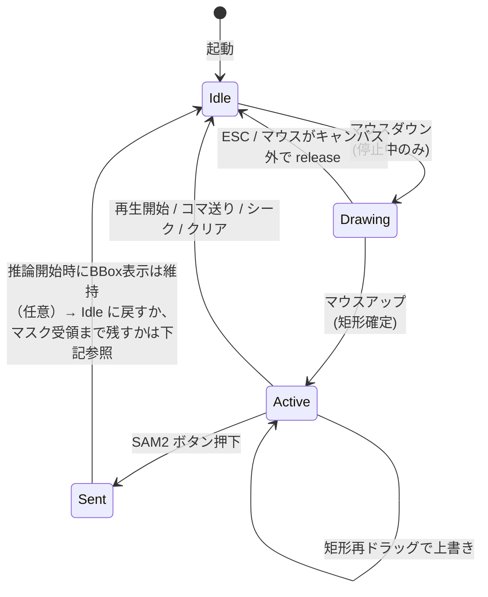
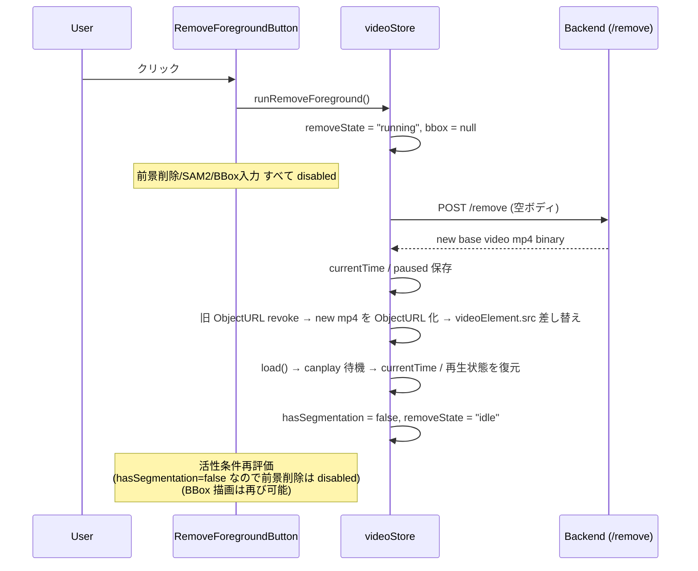
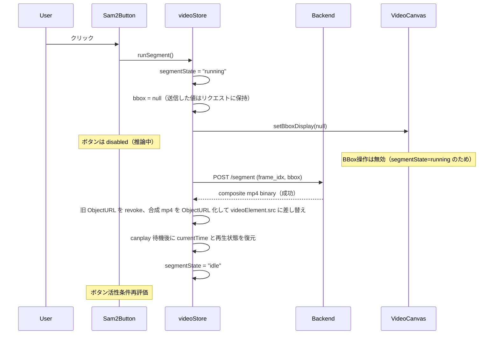
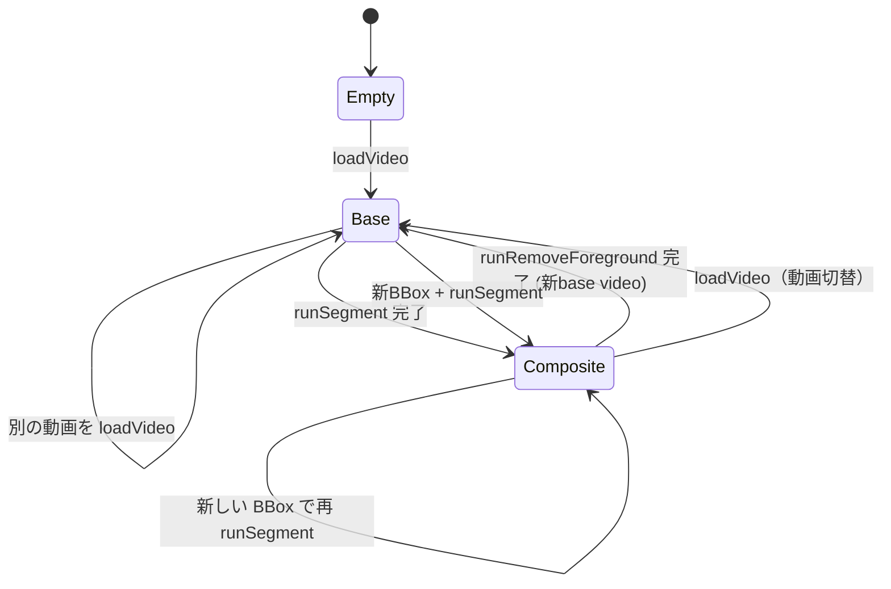
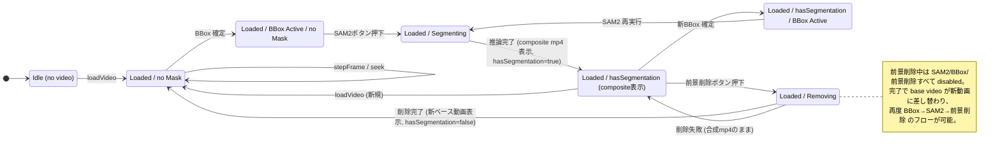

# 09. 状態遷移

本仕様で最も重要な節。BBox と SAM2 ボタンの活性／表示状態、および推論中の遷移を厳密に定義する。

## 9.1 用語

- **BBox 有効** = `videoStore.bbox !== null`
- **動画停止中** = `videoStore.isPlaying === false`
- **SAM2 推論中** = `videoStore.segmentState === "running"`
- **前景削除中** = `videoStore.removeState === "running"`
- **動画ロード済み** = `videoStore.videoMeta !== null`（バックエンドにセッションが存在することを示す）
- **マスク保持中** = `videoStore.hasSegmentation === true`（直近 SAM2 結果がサーバ側 MaskStore に存在し、合成 mp4 を表示中）

モデルロード状態はフロント側で保持しない（`/session` 呼び出し時にバックエンドが `wait_ready(5.0)` で待ち合わせる）。モデルロード未完了時は `/session` が 503 を返し、`segmentState`/`segmentError` のエラー経路で扱う。

## 9.2 BBox の状態遷移

### 9.2.1 フェーズ

BBox は以下の3フェーズを取る。



### 9.2.2 各フェーズの定義

| フェーズ | 定義 | 表示 | `videoStore.bbox` |
|---|---|---|---|
| Idle | BBox なし | 描画なし | `null` |
| Drawing | ドラッグ中（マウスダウン〜アップの間） | 動的に矩形を描く | （ローカルのみ。ストアには未反映） |
| Active | 確定済み | 矩形を表示 | `Bbox` |
| Sent | SAM2 へ送信済み | 表示はクリア（[9.2.3](#923-sam2-送信時の-bbox-クリア仕様) 参照） | `null` |

### 9.2.3 SAM2 送信時の BBox クリア仕様

> 要件: 「SAM2ボタンを押してバウンディングボックスの情報を送ったら、新たなバウンディングボックスの指定をできるようにする」

これに従い、**SAM2 ボタン押下と同時に BBox をクリアする**。具体的には:

- `runSegment` の最初で `bbox` を `null` にし、表示も消す
- 直後から、ユーザーは新しい BBox を描き始められる
- 推論中であっても新規 BBox 描画は **可能**（描いておけば、推論完了後に SAM2 ボタンを押せる）
- ただし、推論中は SAM2 ボタンは disabled なので、新規 BBox を描いても即時実行はできない

### 9.2.4 BBox を強制クリアするトリガ

| トリガ | 結果 |
|---|---|
| `play()` / `togglePlay()` で再生開始 | BBox クリア |
| `stepFrame(±1)` でコマ送り／戻し | BBox クリア |
| `seekTo()` でシーク | BBox クリア |
| `loadVideo()` で動画切替 | BBox クリア（他の状態も含めてリセット） |
| `runSegment()` 開始 | BBox クリア（[9.2.3](#923-sam2-送信時の-bbox-クリア仕様)） |
| `runRemoveForeground()` 開始 | BBox クリア。前景削除中は新規 BBox 描画も無効 |
| `runRemoveForeground()` 完了 | `hasSegmentation = false` に戻り、合成 mp4 を破棄して新 base video を表示 |
| Esc キー（任意機能） | BBox クリア |

クリア＝`videoStore.setBbox(null)` および `VideoCanvas.clearBbox()` を両方実行する。

### 9.2.5 BBox の操作可否

`VideoCanvas.setBboxInteractive(enabled)` を以下条件で呼ぶ:

```
enabled = isLoaded && !isPlaying && segmentState !== "running" && removeState !== "running"
```

- 動画ロード済み・停止中・SAM2推論中でない・前景削除中でない: BBox を描画可能
- 再生中: マウスイベント無効。表示も非表示
- SAM2 推論中 / 前景削除中: 停止中であっても BBox 操作は無効
- ロード前: マウスイベント無効

> **注（仕様変更）**: 当初は推論中でも BBox 描画を許可する設計だったが、実装では推論完了を待ってから次の BBox を描く UX に変更している。推論が完了すると `segmentState` が `"idle"` に戻り、BBox 操作が再び可能になる。

## 9.3 SAM2 ボタンの状態遷移

### 9.3.1 活性条件

```
Sam2Button.active =
    isLoaded &&
    !isPlaying &&
    bbox !== null &&
    segmentState !== "running" &&
    removeState !== "running"
```

すべての条件を満たすときのみ **活性**。それ以外は **disabled（グレーアウト）**。

| 条件 | 必要理由 |
|---|---|
| `isLoaded` | 動画とセッションが必要 |
| `!isPlaying` | BBox 指定は停止中のみのため、論理的に必須 |
| `bbox !== null` | 推論にBBoxが必要 |
| `segmentState !== "running"` | 同時に複数の推論を開始しない |
| `removeState !== "running"` | 前景削除中はベース動画が確定するまで SAM2 を打たせない |

モデルロード未完了の場合は押下後に `/segment` が 503 を返し、`segmentState = "error"` に遷移する（活性判定の段階では区別しない）。

### 9.3a RemoveForegroundButton の状態遷移

#### 9.3a.1 活性条件

```
RemoveForegroundButton.active =
    isLoaded &&
    !isPlaying &&
    hasSegmentation &&
    segmentState !== "running" &&
    removeState !== "running"
```

| 条件 | 必要理由 |
|---|---|
| `isLoaded` | 動画とセッションが必要 |
| `!isPlaying` | 推論中は再生不可。停止中で揃える |
| `hasSegmentation` | サーバ側 MaskStore に直近のマスクがある＝合成 mp4 を表示中（要件 F9） |
| `segmentState !== "running"` | SAM2 結果待ちの間は前景削除を打てない |
| `removeState !== "running"` | 同時に複数の前景削除を開始しない |

#### 9.3a.2 押下時の動作



#### 9.3a.3 失敗時

- `removeState = "error"`、`removeError = message`
- `videoElement.src` は変更しない（合成 mp4 のまま）
- `hasSegmentation` も維持（再試行可能なように）
- ユーザーへエラー表示（`RemoveForegroundButton` 横にメッセージ）

### 9.3.2 押下時の動作



### 9.3.3 推論失敗時

- `segmentState = "error"`、`segmentError = message`
- 表示中の動画は変更しない（前回成功した合成動画があればそのまま継続表示）
- ユーザーへエラー表示（`Sam2Button` 横にメッセージ）
- ユーザーが新しい BBox を描けば再試行可能

### 9.3.4 推論中の表示

- ボタンラベルを「処理中…」or スピナー表示
- ボタンは `disabled`
- キャンバス上に簡易インジケータ（任意）

## 9.4 再生・シーク中の整合性

| 操作 | 直前に必ず行うこと |
|---|---|
| `play()` | BBox クリア。マスクは保持 |
| `pause()` | 何もしない |
| `stepFrame()` | `pause()` を呼んでから seek。BBox クリア |
| `seekTo()` | `pause()` を呼んでから seek（再生中なら）。BBox クリア |

これにより [9.2.5](#925-bbox-の操作可否) の `enabled` 評価が常に矛盾しない。

## 9.5 動画ソース（`videoElement.src`）のライフサイクル

`videoElement` は使い回し、`src`（ObjectURL）だけが状態に応じて差し替わる。

| 状態 | `videoElement.src` の中身 |
|---|---|
| 動画未ロード | `""`（空） |
| base video 再生中 | `loadVideo` で生成した原動画 ObjectURL、または `runRemoveForeground` 完了で受け取った前景削除済み mp4 ObjectURL |
| 合成動画再生中 | `runSegment` 完了でサーバから受け取った合成 mp4 ObjectURL |



- `videoElement.src` を差し替えるたびに古い ObjectURL を `URL.revokeObjectURL`
- 合成動画 / 新 base video への切り替え時は `currentTime` と `paused` を保存し、`canplay` 後に復元する（再生位置を維持）

## 9.6 全体の状態遷移マップ



## 9.7 SAM2ボタンと UI 要素の活性表

| UI | 活性条件 |
|---|---|
| `LoadVideoButton` | 常時活性 |
| `Sam2Button` | `isLoaded && !isPlaying && bbox != null && segmentState != "running" && removeState != "running"` |
| `RemoveForegroundButton` | `isLoaded && !isPlaying && hasSegmentation && segmentState != "running" && removeState != "running"` |
| `PlaybackControls.play/pause` | `isLoaded` |
| `PlaybackControls.step` | `isLoaded && !isPlaying` |
| `Seekbar` | `isLoaded` |
| Pixi BBox 入力 | `isLoaded && !isPlaying && segmentState != "running" && removeState != "running"` |

## 9.8 実装チェックリスト

- [ ] BBox は再生開始・コマ送り・シーク・動画切替で必ずクリアされる
- [ ] SAM2 ボタンの活性条件が [9.3.1](#931-活性条件) のとおりに実装されている
- [ ] SAM2 ボタン押下と同時に BBox がクリアされ、推論中も新規 BBox を描ける
- [ ] 推論中は SAM2 ボタンが disabled
- [ ] 推論完了で `videoElement.src` が合成動画に差し替わり、古い ObjectURL が revoke される
- [ ] 差し替え後に再生位置と再生状態が復元される
- [ ] 推論失敗時にエラー表示が出る
- [ ] 動画ロード前は SAM2 ボタンとシークバーが disabled
- [ ] `RemoveForegroundButton` は `hasSegmentation` が真かつ非実行中のみ活性
- [ ] 前景削除中は SAM2 ボタンと BBox 入力が disabled
- [ ] 前景削除完了で `videoElement.src` が新 base video に差し替わり、`hasSegmentation = false` に戻る
- [ ] 前景削除後の動画に対して再度 BBox 指定 → SAM2 → 前景削除のフローが回る
- [ ] 前景削除失敗時は表示中の合成 mp4 が維持され、エラー表示が出る
